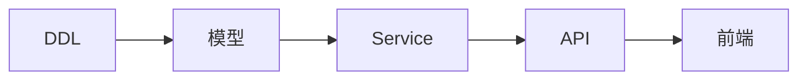

# Feature 详细设计 Skill

## 目标

为单个 Feature 产出可直接指导研发的完整技术设计文档，包含 DDL、接口定义、代码骨架、任务拆解和测试用例。

## 输入要求

在开始设计前，必须获取以下三类输入：

### 1. 需求输入（-product-level）
- **Feature 描述**：功能目标、业务价值、用户场景
- **需求规格说明**：功能需求、非功能需求、验收标准
- **产品原型或交互设计**：UI/UX 设计稿、流程图

### 2. 软件顶层设计（architecture-level）
- **系统架构文档**：整体技术架构、分层设计、技术栈选型
- **部署架构**：服务拓扑、网络架构、存储架构
- **全局约束**：性能指标、安全要求、合规要求

### 3. 模块设计（module-level）
- **模块划分**：该 Feature 所属模块、与其他模块的边界
- **组件设计**：涉及的核心组件、组件职责定义
- **接口框架**：模块对外暴露的接口契约（protobuf/OpenAPI 框架）
- **数据框架**：模块涉及的核心数据实体、数据流转关系

**输入缺失处理**：
- 如缺少顶层设计，需先梳理系统架构和技术约束
- 如缺少模块设计，需在 Step 1 中补充模块边界分析
- 如缺少需求细节，需澄清功能范围和验收标准后再开始

## 输出规范

为每个 Feature 创建独立目录，包含以下 6 个标准文件：

```
docs/features/F{n}-{feature-name}/
├── 01-ddl.sql                    # 数据库DDL脚本
├── 02-openapi.yaml               # OpenAPI 3.0接口定义
├── 03-interface-spec.md          # 详细接口规范
├── 04-code-skeleton/             # 代码骨架目录
│   ├── backend/                  # 后端代码骨架
│   └── frontend/                 # 前端代码骨架（如需要）
├── 05-task-breakdown.md          # 研发任务拆解
└── 06-acceptance-tests.md        # 验收测试用例
```

## 执行步骤

### Step 1: 需求理解与约束对齐

**核心任务**：完整阅读并理解三类输入文档，建立 Feature 设计的约束边界。

**执行动作**：

1. **阅读需求输入**
   - 提取功能目标、用户场景
   - 明确验收标准（什么算完成）
   - 识别核心业务实体和数据对象

2. **阅读顶层设计**
   - 理解系统整体架构（分层、服务划分）
   - 明确技术栈约束（语言、框架、中间件）
   - 识别全局非功能要求（性能、安全、可用性）

3. **阅读模块设计**
   - 确定该 Feature 在模块中的位置
   - 理解模块对外接口契约（如需继承或扩展）
   - 明确与周边模块的依赖关系

4. **建立 Feature 边界**
   ```markdown
   ## F{n} {Feature名称} - 设计边界

   ### 功能边界
   - **包含**：...
   - **不包含**：...

   ### 架构约束
   - **所属模块**：...
   - **依赖模块**：...
   - **被依赖接口**：...

   ### 技术约束
   - **技术栈**：...
   - **性能要求**：...
   - **安全要求**：...

   ### 数据实体
   - **核心实体**：...
   - **关联实体**：...
   ```

**输出**：Feature 设计边界文档（可保存在 `00-design-boundary.md` 或作为 Step 1 的总结）

---

### Step 2: 编写 01-ddl.sql

**设计原则**：
- 每张表必须有主键、created_at、updated_at
- 外键关系显式定义，设置级联规则
- 为查询场景设计复合索引
- 大表考虑分区策略
- 敏感字段考虑加密存储

**必含内容**：
```sql
-- 1. 主业务表（根据Feature确定）
CREATE TABLE {main_entity} (
    id BIGSERIAL PRIMARY KEY,
    -- 业务字段
    created_at TIMESTAMPTZ DEFAULT NOW(),
    updated_at TIMESTAMPTZ DEFAULT NOW()
);

-- 2. 关联表（多对多关系）
-- 3. 索引（覆盖查询场景）
-- 4. 触发器（自动更新updated_at等）
-- 5. 注释（说明表和字段用途）
```

---

### Step 3: 编写 02-openapi.yaml

**格式要求**：OpenAPI 3.0.3

**必含内容**：
```yaml
openapi: 3.0.3
info:
  title: {Feature} API
  version: 1.0.0
paths:
  /{resource}:
    get:    # 查询列表
    post:   # 创建
  /{resource}/{id}:
    get:    # 查询详情
    put:    # 更新
    delete: # 删除
components:
  schemas:  # 请求/响应模型
  securitySchemes: # 认证方式
```

**每个端点必须定义**：
- 路径参数、查询参数、请求体
- 响应状态码和响应体
- 错误响应（400, 401, 403, 404, 500）
- 安全要求（认证/授权）

---

### Step 4: 编写 03-interface-spec.md

**内容结构**：
```markdown
# {Feature} 接口规范

## 1. 接口清单
| 接口ID | 名称 | 类型 | 调用方 | 提供方 |

## 2. 详细接口定义
### IF-{n} {接口名}
**输入参数**：
| 字段 | 类型 | 必填 | 约束 | 说明 |

**输出结果**：
| 字段 | 类型 | 说明 |

**错误码**：
| 错误码 | 场景 | 处理建议 |

**超时/重试策略**：

## 3. 时序图（关键流程）
```

---

### Step 5: 编写 04-code-skeleton/

根据技术栈生成代码骨架：

**后端（以 FastAPI 为例）**：
```python
# models/schemas.py - Pydantic模型
class {Entity}Create(BaseModel):
    """创建请求模型"""

class {Entity}Response(BaseModel):
    """响应模型"""

# services/{entity}_service.py - 业务逻辑
class {Entity}Service:
    async def create(self, data: {Entity}Create) -> {Entity}Response:
        """创建实体"""
        pass

    async def get_by_id(self, id: int) -> {Entity}Response:
        """根据ID查询"""
        pass

# api/routes.py - API路由
@router.post("/{resource}", response_model={Entity}Response)
async def create_{entity}(data: {Entity}Create):
    """创建接口"""
    pass
```

**前端（以 Vue3 为例）**：

**必须包含的文件结构**：
```
04-code-skeleton/
├── backend/              # 后端代码骨架
│   ├── models/
│   │   ├── schemas.py    # Pydantic模型
│   │   └── database.py   # SQLAlchemy ORM模型
│   ├── services/
│   │   └── {entity}_service.py  # 业务逻辑
│   └── api/
│       └── routes.py     # API路由
└── frontend/             # 前端代码骨架（Vue3 + TypeScript）
    ├── types/
    │   └── {entity}.ts   # TypeScript类型定义
    ├── api/
    │   └── {entity}.ts   # API客户端
    └── views/
        └── {Feature}/
            ├── index.vue              # 列表页面（主入口）
            └── components/
                ├── ListTable.vue      # 表格组件（展示+分页+操作）
                ├── SearchForm.vue     # 搜索表单（筛选条件）
                ├── EditDialog.vue     # 编辑弹窗（创建/修改）
                └── DetailDrawer.vue   # 详情抽屉（可选）
```

**前端组件代码示例**：
```typescript
// types/{entity}.ts - 类型定义
export interface {Entity} {
  id: number;
  name: string;
  // ... 其他字段
}

export interface {Entity}CreateRequest {
  name: string;
  // ...
}

export interface {Entity}ListParams {
  page?: number;
  pageSize?: number;
  keyword?: string;
}
```

```typescript
// api/{entity}.ts - API客户端
import request from '@/utils/request'
import type { {Entity}, {Entity}CreateRequest, {Entity}ListParams } from '@/types/{entity}'

const BASE_URL = '/api/v1/{features}'

export const {entity}Api = {
  getList: (params: {Entity}ListParams) => request.get(BASE_URL, { params }),
  getById: (id: number) => request.get(`${BASE_URL}/${id}`),
  create: (data: {Entity}CreateRequest) => request.post(BASE_URL, data),
  update: (id: number, data: Partial<{Entity}CreateRequest>) => request.put(`${BASE_URL}/${id}`, data),
  delete: (id: number) => request.delete(`${BASE_URL}/${id}`)
}
```

```vue
<!-- views/{Feature}/index.vue - 列表页面 -->
<template>
  <div class="{feature}-page">
    <SearchForm v-model="searchParams" @search="handleSearch" />
    <el-button type="primary" @click="handleCreate">新建</el-button>
    <ListTable
      :data="listData"
      :loading="loading"
      :pagination="pagination"
      @page-change="handlePageChange"
      @edit="handleEdit"
      @delete="handleDelete"
    />
    <EditDialog v-model="dialogVisible" :data="currentRow" @success="handleSuccess" />
  </div>
</template>

<script setup lang="ts">
import { ref, reactive, onMounted } from 'vue'
import SearchForm from './components/SearchForm.vue'
import ListTable from './components/ListTable.vue'
import EditDialog from './components/EditDialog.vue'
import { {entity}Api } from '@/api/{entity}'
import type { {Entity}, {Entity}ListParams } from '@/types/{entity}'

// ... 实现逻辑
</script>
```

---

### Step 6: 编写 05-task-breakdown.md

**内容结构**：
```markdown
# {Feature} 研发任务拆解

## 1. 任务清单

### 后端任务
| 任务ID | 任务描述 | 预估工时 | 依赖 |
| BE-001 | 数据库DDL执行 | 2h | 无 |
| BE-002 | 实体模型定义 | 2h | BE-001 |

### 前端任务
| 任务ID | 任务描述 | 预估工时 | 依赖 |
| FE-001 | 页面框架搭建 | 4h | 无 |

## 2. 接口实现顺序

### Phase 1: 基础设施
顺序: BE-001 -> BE-002 -> ...
产出: 可编译运行的基础框架

### Phase 2: 核心功能
...

### Phase 3: 接口联调
...

## 3. 关键路径

```

---

### Step 7: 编写 06-acceptance-tests.md

**内容结构**：
```markdown
# {Feature} 验收测试用例

## 1. 单元测试

### UT-{n}: {测试场景}
| 项目 | 内容 |
|---|---|
| 用例ID | UT-{n} |
| 测试目的 | ... |
| 测试对象 | ... |
| 前置条件 | ... |

**测试步骤：**
1. ...
2. ...

**期望结果：**
- ...

**验收标准：**
- ...

## 2. 集成测试

### IT-{n}: {测试场景}
...

## 3. 端到端测试

### E2E-{n}: {测试场景}
...
```

## 执行策略

对于复杂 Feature，建议分阶段执行以避免超时或输出不完整：

**阶段划分**：
| 阶段 | 步骤 | 内容 | 建议保存点 |
|------|------|------|------------|
| **阶段A** | Step 1-3 | 需求理解 + 数据设计 + 接口定义 | 完成后保存 00~03 文件 |
| **阶段B** | Step 4-5 | 接口规范 + 代码骨架 | 完成后保存 03~04 文件 |
| **阶段C** | Step 6-7 | 任务拆解 + 测试用例 | 完成后保存 05~06 文件 |

**执行建议**：
1. 每阶段完成后立即保存文件，避免因超时丢失工作
2. 如使用子 Agent 执行，可在 prompt 中指定执行特定阶段
3. 复杂 Feature（>10张表、>20接口）优先考虑分阶段执行
4. 简单 Feature（<5张表、<10接口）可一次性执行全部步骤

**分阶段执行 prompt 示例**：
```
请执行 Feature 详细设计的【阶段A】：
- Step 1: 需求理解与约束对齐
- Step 2: 编写 01-ddl.sql
- Step 3: 编写 02-openapi.yaml

完成后保存文件到指定目录。
```

## 技术栈适配

本 Skill 支持多种技术栈，根据项目实际情况选择：

| 层级 | 选项A | 选项B | 选项C | 选项D |
|------|-------|-------|-------|-------|
| 后端 | FastAPI/Python | Spring Boot/Java | NestJS/Node | C/C++ |
| 前端 | Vue3/TS | React/TS | Angular | - |
| 数据库 | PostgreSQL | MySQL | MongoDB | - |
| 缓存 | Redis | - | - | - |
| 通信 | REST | gRPC | GraphQL | - |

## 质量检查清单

交付前自检以下项目：

- [ ] Step 1 已完成约束对齐，明确 Feature 边界
- [ ] DDL 脚本可直接执行（无语法错误）
- [ ] OpenAPI 符合 3.0 规范（可用 Swagger Editor 验证）
- [ ] 接口定义包含完整的输入/输出/错误码
- [ ] 代码骨架使用正确语法（可编译/解析）
- [ ] 任务拆解有明确的依赖关系和工时估算
- [ ] 测试用例覆盖正常/异常/边界场景
- [ ] 所有文档使用中文编写

## 注意事项

1. **约束优先**：严格遵循顶层架构和模块设计的约束，不偏离既定技术路线
2. **边界清晰**：在 Step 1 中明确 Feature 与周边的边界，避免职责蔓延
3. **接口优先**：先定义接口契约，再设计内部实现
4. **可执行性**：DDL 和代码骨架必须是可直接使用的，而非伪代码
5. **适度设计**：不引入未要求的复杂架构，但核心设计要完整
6. **错误处理**：明确定义错误码和降级策略

## 参考资料

本 Skill 附带以下参考模板，可在执行各步骤时参考：

| 文件 | 路径 | 说明 |
|------|------|------|
| **DDL 模板** | `references/ddl-template.sql` | PostgreSQL DDL 完整模板（含索引、触发器、分区表、SQLite边缘缓存） |
| **OpenAPI 模板** | `references/openapi-template.yaml` | OpenAPI 3.0 标准模板（含认证、CRUD接口、错误响应、分页） |
| **代码骨架模板** | `references/code-skeleton-examples.md` | FastAPI/Spring Boot/Vue3 代码骨架完整示例 |
| **验收测试模板** | `references/acceptance-tests-template.md` | 单元/集成/E2E/性能/安全测试用例模板 |

**使用方式**：
- 在编写对应步骤时，先阅读参考模板了解标准结构
- 根据实际 Feature 需求替换模板中的占位符（如 `{entity}`、`{Feature}`）
- 保持模板中定义的良好实践（如字段命名、校验规则、错误处理）

**模板特点**：
- 经过多个 Feature 实践验证
- 遵循各技术栈最佳实践
- 可直接复制修改使用
