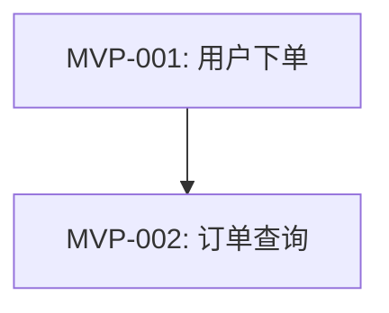

# MVP 范围定义文档（示例）

## 文档元信息

| 项目 | 内容 |
|---|---|
| 文档版本 | v1.0 |
| 生成日期 | 2026-04-20 |
| 最后更新 | 2026-04-20 |
| 创建日期 | 2026-04-20 |
| 作者 | RA-Agent |
| 状态 | 评审中 |

## 1. MVP 摘要

| 项目 | 内容 |
|---|---|
| skill_id | G103 |
| 产出阶段 | requirements |
| 输出路径 | artifacts/requirements/004-mvp-definition.md |
| 生成日期 | 2026-04-20 |
| 输入来源 | 003-requirements-baseline.md |
| 示例参考 | examples/sample-004-mvp-definition.md |

### 1.1 执行摘要

- MVP 功能总数：3
- In-scope 数量：2
- Out-of-scope 数量：1
- 发布阻断风险数量：1
- 主要取舍结论：优先保障核心下单闭环，报表能力延后到下一版本。

## 2. MVP 功能候选清单

方法执行证据：

- [x] 第一性原理：已拆分“核心闭环必须项”和“可延期项”
- [x] 问题风暴：已形成候选问题池并归并为 3 个 MVP 条目
- [x] 决策树：已形成 in-scope/out-of-scope 决策路径
- [ ] 角色扮演：本轮未启用，原因：当前范围争议集中在资源约束，角色差异影响有限

| MVP-ID | 来源需求ID(FR/NFR) | 功能描述 | 业务价值 | 技术可行性 | 建议结论 |
|---|---|---|---|---|---|
| MVP-001 | FR-001 | 用户下单 | 高 | 高 | in-scope |
| MVP-002 | FR-002 | 订单查询 | 高 | 中 | in-scope |
| MVP-003 | FR-010 | 多维报表 | 中 | 中 | out-of-scope |

## 3. 范围边界（In/Out）

方法执行证据：

- [x] 约束映射：`CST-001`、`CST-002` 已映射到边界条目
- [x] 解决方案矩阵：已完成价值/成本/风险平衡判断
- [x] 六顶思考帽：已完成事实/风险/收益复核
- [ ] 假设反转：本轮未启用，原因：延后项触发条件已具备明确阈值

### 3.1 In-scope

| MVP-ID | 功能描述 | 进入依据 | 依赖项 | 验收标准ID | 风险ID |
|---|---|---|---|---|---|
| MVP-001 | 用户下单 | Must + 业务闭环核心 | 支付接口 | AC-001 | R-001 |
| MVP-002 | 订单查询 | Must + 客服最小可用 | 订单索引 | AC-002 | R-002 |

### 3.2 Out-of-scope

| MVP-ID | 功能描述 | 延后原因 | 计划版本 | 触发条件 |
|---|---|---|---|---|
| MVP-003 | 多维报表 | 当前周期资源不足 | v1.1 | 核心闭环稳定 + 资源释放 |

## 4. 验收标准与发布门槛

方法执行证据：

- [x] 失败分析：已识别发布失败高风险场景并转化为门槛项
- [x] 决策树：已定义未达标时阻断发布路径
- [ ] SCAMPER：本轮未启用，原因：当前阶段目标为冻结最小范围，非方案扩展

### 4.1 MVP 整体验收标准

| 维度 | 验收标准 | 验证方法 |
|---|---|---|
| 功能完整性 | in-scope 功能全部通过 | 用例回归 |
| 关键质量属性 | 查询 P95 < 800ms | 性能测试 |
| 发布可用性 | 无 critical/major 缺陷 | 缺陷清单检查 |

### 4.2 条目级验收标准

| 验收标准ID | 对象ID(MVP-ID) | 验收标准描述 | 验证方法 | 责任方 |
|---|---|---|---|---|
| AC-001 | MVP-001 | 下单全链路成功率 >= 99% | 接口+E2E 测试 | QA |
| AC-002 | MVP-002 | 查询返回正确且响应满足阈值 | 接口+性能测试 | QA |

### 4.3 发布门槛

| 门槛项 | 阈值 | 未达标处理 |
|---|---|---|
| 关键功能通过率 | 100% | 阻断发布，进入返工 |
| 关键缺陷数量 | critical=0, major=0 | 阻断发布 |
| 阻断风险状态 | 全部关闭 | 阻断发布 |

## 5. 风险清单

方法执行证据：

- [x] 失败分析：技术/项目风险已给出缓解措施
- [x] 六顶思考帽：已复核风险与收益平衡
- [ ] 类比思维：本轮未启用，原因：现有风险已由本项目历史数据覆盖

| 风险ID | 类型(技术/业务/项目) | 描述 | 影响 | 概率 | 缓解措施 | 状态 |
|---|---|---|---|---|---|---|
| R-001 | 技术 | 支付接口波动 | 高 | 中 | 增加重试与降级 | open |
| R-002 | 项目 | 查询索引构建延期 | 中 | 中 | 拆分并行任务 | open |
| R-003 | 业务 | 多维报表延后导致运营洞察滞后 | 中 | 中 | 在 v1.1 前提供临时报表导出 | open |

## 6. 追溯与证据

| 对象ID | 来源需求ID | 约束ID(CST) | 验收标准ID | 风险ID | 状态 |
|---|---|---|---|---|---|
| MVP-001 | FR-001 | CST-001 | AC-001 | R-001 | draft |
| MVP-002 | FR-002 | CST-002 | AC-002 | R-002 | draft |
| MVP-003 | FR-010 | CST-003 | - | R-003 | out_of_scope |

- 输入来源：003-requirements-baseline.md
- 关键决策依据：Must 优先级 + 资源窗口约束
- evidence_path：`evidence/RA-05/`

## 7. 架构关键输入摘要

面向 architecture 阶段（S5），将 MVP 中分散在各章节的架构相关信息显式收敛。

### 7.1 功能依赖关系

| 上游功能(MVP-ID) | 下游功能(MVP-ID) | 依赖类型 | 依赖说明 |
|---|---|---|---|
| MVP-001 | MVP-002 | 数据依赖 | 下单产生的订单数据是订单查询的数据源，查询需在下单完成后立即可见 |

**依赖关系图**（Mermaid）：

### 7.2 架构迭代优先级映射

| 架构迭代 | MVP-ID 列表 | 分组依据 | 交付约束 |
|---|---|---|---|
| Iter-1 | MVP-001, MVP-002 | 下单与查询构成核心闭环，查询依赖下单数据 | 不可拆分，必须同步上线 |

### 7.3 NFR 约束分级

**硬约束**（MVP 发布前必须满足）：

| NFR-ID | 约束内容 | 量化阈值 | 对架构的影响 |
|---|---|---|---|
| NFR-001 | 查询响应时间 | P95 < 800ms | 需考虑索引策略与缓存方案 |
| NFR-003 | 下单成功率 | >= 99% | 需考虑支付接口重试与幂等设计 |

**软约束**（本期记录，后续版本逐步满足）：

| NFR-ID | 约束内容 | 目标版本 | 当前可接受的降级口径 |
|---|---|---|---|
| NFR-005 | 全链路可观测性 | v1.1 | 本期仅保留关键错误日志，不要求分布式追踪 |

### 7.4 架构敏感风险

| 风险ID | 风险描述 | 架构影响面 | 设计阶段需闭合的假设 |
|---|---|---|---|
| R-001 | 支付接口波动导致下单失败 | 需设计重试、降级和幂等机制 | 支付接口 SLA 假设（可用率 >= 99.5%）需与支付团队确认 |
| R-002 | 查询索引构建延期 | 影响查询性能目标的达成路径 | 索引构建方案需在架构设计中给出 fallback 方案 |

## 8. AD-Agent 消费字段映射（示例）

| 字段键 | 示例值来源 |
|---|---|
| mvp_scope.in_scope | 3.1 In-scope（MVP-001, MVP-002） |
| mvp_scope.out_of_scope | 3.2 Out-of-scope（MVP-003） |
| mvp_acceptance | 4.1 / 4.2 |
| mvp_risks | 5. 风险清单 |
| release_gate | 4.3 发布门槛 |
| arch_input.functional_dependencies | 7.1 功能依赖关系 |
| arch_input.iteration_priority_map | 7.2 架构迭代优先级映射 |
| arch_input.nfr_hard_constraints | 7.3 NFR 约束分级（硬约束） |
| arch_input.nfr_soft_constraints | 7.3 NFR 约束分级（软约束） |
| arch_input.architecture_sensitive_risks | 7.4 架构敏感风险 |

## 9. 质量检查对齐信息（RA-06 回填示例）

| 项目 | 值 |
|---|---|
| checker_tool | GS-Quality-Check |
| quality_report_path | artifacts/reviews/requirements-quality-check.md |
| quality_check_summary.overall_status | pass_with_warning |
| quality_check_summary.scores.completeness | 96 |
| quality_check_summary.scores.traceability | 100 |
| quality_check_summary.scores.markdown_format | 98 |
| validation_summary.issue_count.critical | 0 |
| validation_summary.issue_count.major | 0 |
| validation_summary.issue_count.minor | 2 |
| checked_at | 2026-04-20 12:30:00 |
