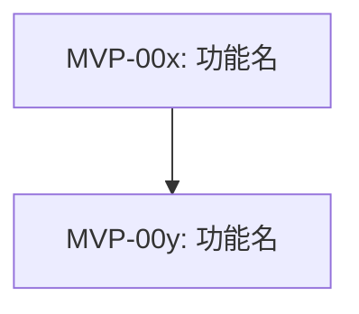

# MVP 范围定义文档

## 文档元信息

| 项目 | 内容 |
|---|---|
| 文档版本 | v1.0 |
| 生成日期 | YYYY-MM-DD |
| 最后更新 | YYYY-MM-DD |
| 创建日期 | YYYY-MM-DD |
| 作者 | RA-Agent / 人工评审者 |
| 状态 | 草稿 / 评审中 / 已通过 |

## 1. MVP 摘要

| 项目 | 内容 |
|---|---|
| skill_id | G103 |
| 产出阶段 | requirements |
| 输出路径 | artifacts/requirements/004-mvp-definition.md |
| 生成日期 | YYYY-MM-DD |
| 输入来源 | 003 / 002（如有） |
| 示例参考 | examples/sample-004-mvp-definition.md |

### 1.1 执行摘要

- MVP 功能总数：
- In-scope 数量：
- Out-of-scope 数量：
- **含前端界面的 MVP 数量：**
- 发布阻断风险数量：
- 主要取舍结论：

## 2. MVP 功能候选清单

### 方法检查清单

- [ ] 必用：第一性原理（核心价值与必要性交叉验证）
- [ ] 必用：问题风暴（候选功能问题池已收敛）
- [ ] 必用：决策树（功能取舍路径已明确）
- [ ] 可选：角色扮演（多角色价值验证完成）

| MVP-ID | 来源需求ID(FR/NFR) | 基线优先级 | 功能描述 | 业务价值 | 技术可行性 | 建议结论 |
|---|---|---|---|---|---|---|
| MVP-001 | FR-001 | Must |  |  |  | in-scope |

## 3. 范围边界（In/Out）

### 方法检查清单

- [ ] 必用：约束映射（CST 约束已映射到边界结论）
- [ ] 必用：解决方案矩阵（价值/成本/风险平衡已体现）
- [ ] 必用：六顶思考帽（边界结论已复核）
- [ ] 可选：假设反转（延后项已反向验证）

### 范围边界分层规则

MVP 范围边界按 G102 需求基线的 MoSCoW 优先级收敛：

- **Must（必须有）**：基线中全部 Must 优先级需求必须纳入 in-scope，不可排除或延后。
- **Should（应该有）**：基线中全部 Should 优先级需求**必须纳入 in-scope**，不可排除或延后。Should 与 Must 共同构成 MVP 的完整可交付集合。
- **Could（可以有）**：默认不纳入 MVP，明确标记为 out-of-scope。仅在存在特殊业务约束时考虑纳入，需经约束映射和解决方案矩阵验证。
- **Won't（本次不做）**：明确排除，不在 MVP 范围内。

### 3.1 In-scope

| MVP-ID | 功能描述 | 基线优先级 | 进入依据 | 依赖项 | 验收标准ID | 风险ID | **has_frontend_ui** | **frontend_ui_ref** |
|---|---|---|---|---|---|---|---|---|
| MVP-001 |  | Must | 基线强制纳入 |  | AC-001 | R-001 | yes / no | UI-001, UI-002 |
| MVP-002 |  | Must |  |  | AC-002 | R-002 | no | - |

### 3.2 Out-of-scope

| MVP-ID | 功能描述 | 基线优先级 | 延后原因 | 计划版本 | 触发条件 |
|---|---|---|---|---|---|
| MVP-003 |  | Should / Could |  |  |  |

## 4. 验收标准与发布门槛

### 方法检查清单

- [ ] 必用：解决方案矩阵（功能-验收-门槛映射完成）
- [ ] 必用：失败分析（发布失败模式已覆盖）
- [ ] 必用：决策树（门槛阈值与回退策略可执行）
- [ ] 可选：SCAMPER（补充替代发布策略）

### 4.1 MVP 整体验收标准

| 维度 | 验收标准 | 验证方法 |
|---|---|---|
| 功能完整性 |  |  |
| 关键质量属性 |  |  |
| 发布可用性 |  |  |

### 4.2 条目级验收标准

| 验收标准ID | 对象ID(MVP-ID) | 验收标准描述 | 验证方法 | 责任方 |
|---|---|---|---|---|
| AC-001 | MVP-001 |  |  |  |

### 4.3 发布门槛

| 门槛项 | 阈值 | 未达标处理 |
|---|---|---|
| 关键功能通过率 |  |  |
| 关键缺陷数量 |  |  |
| 阻断风险状态 |  |  |

## 5. 风险清单

### 方法检查清单

- [ ] 必用：失败分析（高概率失败场景已覆盖）
- [ ] 必用：约束映射（约束诱发风险已覆盖）
- [ ] 必用：六顶思考帽（收益/风险平衡已复核）
- [ ] 可选：类比思维（同类项目风险对照完成）

| 风险ID | 类型(技术/业务/项目) | 描述 | 影响 | 概率 | 缓解措施 | 状态 |
|---|---|---|---|---|---|---|
| R-001 | 技术 |  |  |  |  | open |

## 6. 追溯与证据

| 对象ID | 来源需求ID | 约束ID(CST) | 验收标准ID | 风险ID | 状态 |
|---|---|---|---|---|---|
| MVP-001 | FR-001 | CST-001 | AC-001 | R-001 | draft |

- 输入来源：
- 关键决策依据：
- evidence_path：`evidence/RA-05/`

## 7. 架构关键输入摘要

面向 architecture 阶段（S5），将 MVP 中分散在各章节的架构相关信息显式收敛，减少架构师的跨文档拼凑成本。

### 7.1 功能依赖关系

标注 in-scope 功能之间的强依赖关系，帮助架构师识别必须优先考虑的耦合点。

| 上游功能(MVP-ID) | 下游功能(MVP-ID) | 依赖类型 | 依赖说明 |
|---|---|---|---|
| MVP-00x | MVP-00y | 数据依赖 / 流程依赖 / 时序依赖 | |

**依赖关系图**（Mermaid）：

### 7.2 架构迭代优先级映射

将 in-scope 功能按架构交付节奏分组，标识哪些功能必须在同一迭代中交付、哪些可拆分。

| 架构迭代 | MVP-ID 列表 | 分组依据 | 交付约束 |
|---|---|---|---|
| Iter-1 | MVP-00x, MVP-00y | 核心闭环必须同步上线 | 不可拆分 |
| Iter-2 | MVP-00z | 依赖 Iter-1 稳定后交付 | 可延后 |

### 7.3 NFR 约束分级

从 G102 需求基线中提取面向 MVP 的 NFR，区分硬约束（MVP 必须满足）和软约束（可延后到后续版本）。

**硬约束**（MVP 发布前必须满足）：

| NFR-ID | 约束内容 | 量化阈值 | 对架构的影响 |
|---|---|---|---|
| NFR-00x |  |  |  |

**软约束**（本期记录，后续版本逐步满足）：

| NFR-ID | 约束内容 | 目标版本 | 当前可接受的降级口径 |
|---|---|---|---|
| NFR-00y |  |  |  |

### 7.4 架构敏感风险

从风险清单（第 5 章）中筛选对架构设计有直接影响的风险，显式标注其架构影响面。

| 风险ID | 风险描述 | 架构影响面 | 设计阶段需闭合的假设 |
|---|---|---|---|
| R-00x |  |  |  |

### 7.5 前端界面映射

将含前端界面的 MVP 显式收敛，供 G203 架构蓝图识别前端消费方。

| MVP-ID | 功能描述 | has_frontend_ui | 前端界面ID | 界面类型 | 架构关注点 |
|---|---|---|---|---|---|
| MVP-001 |  | yes | UI-001 |  |  |

## 8. AD-Agent 消费字段映射

| 字段键 | 对应位置 | 说明 |
|---|---|---|
| mvp_scope.in_scope | 3.1 In-scope | MVP 纳入项 |
| mvp_scope.out_of_scope | 3.2 Out-of-scope | MVP 排除项 |
| mvp_acceptance | 4.1 / 4.2 | MVP 验收标准 |
| mvp_risks | 5. 风险清单 | 风险与缓解 |
| release_gate | 4.3 发布门槛 | 发布判定门槛 |
| arch_input.functional_dependencies | 7.1 功能依赖关系 | 功能间依赖与耦合点 |
| arch_input.iteration_priority_map | 7.2 架构迭代优先级映射 | 按交付节奏分组的功能集 |
| arch_input.nfr_hard_constraints | 7.3 NFR 约束分级（硬约束） | MVP 必须满足的 NFR |
| arch_input.nfr_soft_constraints | 7.3 NFR 约束分级（软约束） | 可延后的 NFR 与降级口径 |
| arch_input.architecture_sensitive_risks | 7.4 架构敏感风险 | 影响架构决策的风险与待闭合假设 |
| arch_input.frontend_ui_map | 7.5 前端界面映射 | 供 G203 识别前端消费方 |

## 9. 质量检查对齐信息（RA-06 回填）

| 项目 | 值 |
|---|---|
| checker_tool | GS-Quality-Check |
| quality_report_path | artifacts/reviews/requirements-quality-check.md |
| quality_check_summary.overall_status | pass / pass_with_warning / fail |
| quality_check_summary.scores.completeness |  |
| quality_check_summary.scores.traceability |  |
| quality_check_summary.scores.markdown_format |  |
| validation_summary.issue_count.critical |  |
| validation_summary.issue_count.major |  |
| validation_summary.issue_count.minor |  |
| checked_at | YYYY-MM-DD HH:mm:ss |

注：最终验收仅接受 `pass` / `pass_with_warning`。

## 10. 变更记录

| 版本 | 日期 | 变更说明 |
|---|---|---|
| v1.0 | YYYY-MM-DD | 初版创建 |
