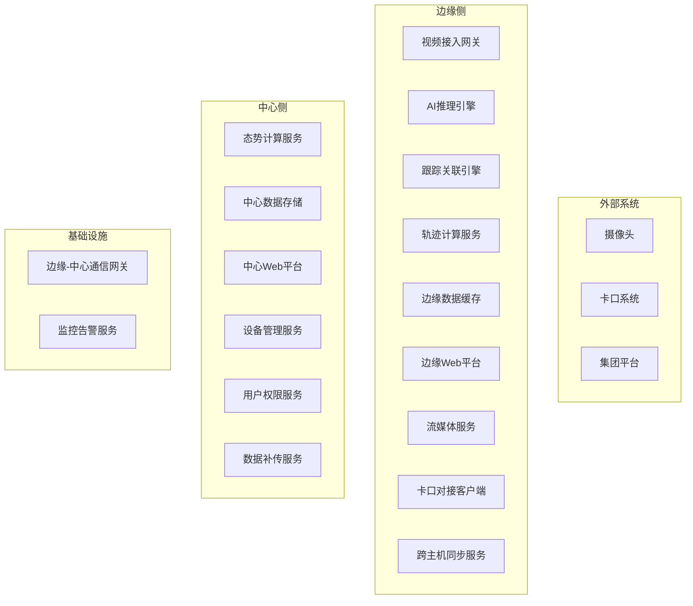
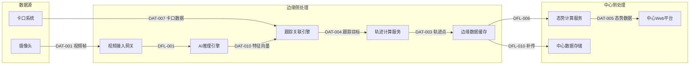
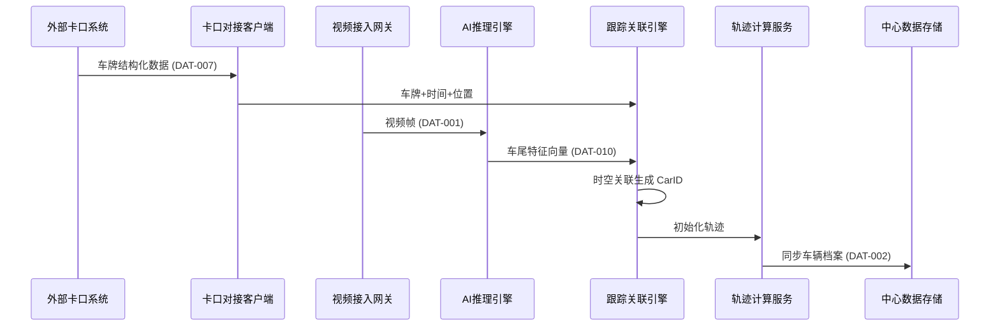
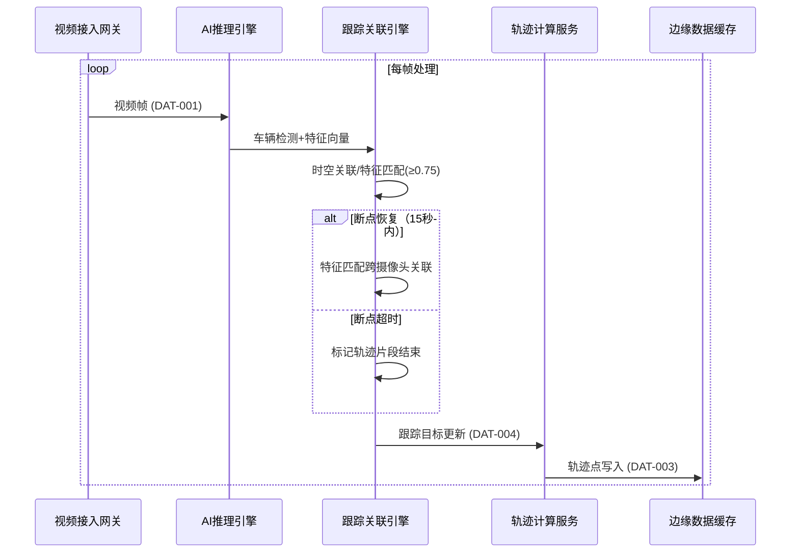
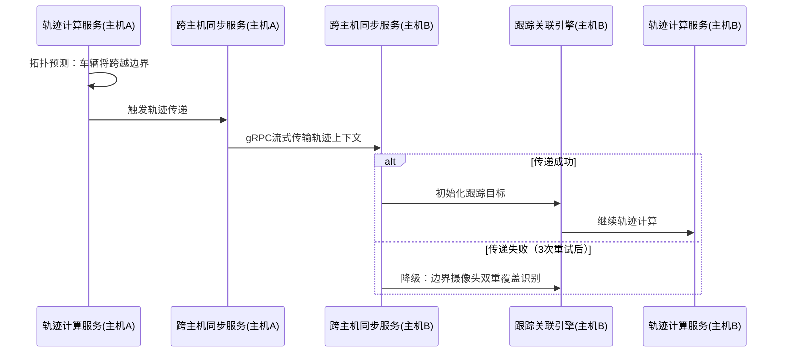
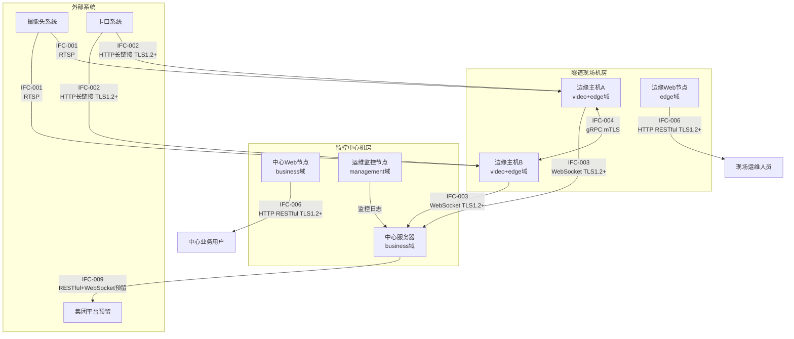

# G203 架构蓝图文档模板

## 1. 蓝图目标与范围

### 1.1 蓝图目标

- 蓝图目标摘要：
- 对齐的技术策略目标：
- 成功标准：

### 1.2 范围边界

| scope_id | 范围项 | 类型 | 说明 | 来源约束 | 备注 |
|---|---|---|---|---|---|
| SCP-001 |  | in_scope / out_of_scope / deferred |  |  |  |

## 2. 架构视图

### 2.1 蓝图视图清单

| view_id | 视图类型 | 目标 | 覆盖对象 | 关键约束 |
|---|---|---|---|---|
| VW-001 | context / structure / interaction / deployment / exception |  |  |  |

### 2.2 视图说明

| view_id | 视图名称 | 核心内容 | 输入来源 | 关联 ADR |
|---|---|---|---|---|
| VW-001 |  |  |  |  |

### 2.3 视图覆盖声明

| legacy_capability | coverage_view_ids | coverage_fields | 覆盖说明 |
|---|---|---|---|
| S5-A02 架构视图 | VW-001 | architecture_views / component_inventory / interaction_flows | 五类视图完整覆盖 context/structure/interaction/deployment/exception |
| S5-A03 数据架构 | VW-001 | data_architecture |  |
| S5-A04 接口架构 | VW-001 | interface_architecture / interaction_flows |  |
| S5-A05 部署架构 | VW-001 | deployment_topology |  |

### 2.4 视图图表索引

| view_id | 图表类型 | 图表作用 | Mermaid 语法类型 |
|---|---|---|---|
| VW-001 | 系统上下文图 | 展示 HTVT 与外部系统的边界、数据流向 | graph TB |
| VW-002 | 组件结构图 | 展示边缘侧/中心侧/基础设施三层组件关系 | graph TB |
| VW-003 | 关键交互时序图 | 展示核心链路的组件交互时序 | sequenceDiagram |
| VW-004 | 部署拓扑图 | 展示运行节点、安全域、网络边界 | graph TB |
| VW-005 | 异常状态机图 | 展示应急状态转换、降级路径 | stateDiagram-v2 |

**图表生成规范**：
1. 每张图表下方必须附"图表与表格对齐声明"，说明图中节点对应正文章节的哪个表格行。
2. 图表中的中文名称必须同时标注英文 component_id（如 `CMP-001[视频接入网关]`）。
3. 图表不得替代表格，同一信息应在表格（精确字段）和图表（直观结构）中同时存在。

## 3. 组件与职责

### 3.1 MVP In-Scope 功能覆盖映射

填写规则：
1. 必须读取 `artifacts/requirements/004-mvp-definition.md` 的 in-scope MVP 列表。
2. SCP-ID 来自蓝图 1.2 节范围边界，必须与 MVP 建立可追溯到下游的映射。
3. `功能描述` 优先复用 MVP 文档原文，不得重新描述。
4. `组件覆盖` 列出承接该 MVP 的全部 CMP-XXX，不得为空。
5. `has_frontend_ui` 从 MVP 文档提取；若 MVP 文档无此字段，依据功能描述推断（涉及 Web 界面、可视化、查询报表等标记为 yes）。
6. `uiux_ref` 从 MVP 文档提取；若 MVP 文档无此字段，可引用相关原型/设计文档路径，或标注 `待详细设计阶段补充`。

| SCP-ID | MVP-ID | FR-ID | 功能描述 | 优先级 | 组件覆盖 | has_frontend_ui | uiux_ref |
|---|---|---|---|---|---|---|---|
| SCP-001 | MVP-001 | FR-VIDEO-001 |  | Must / Should / Could | CMP-001, CMP-002 | yes / no |  |

### 3.2 组件清单

| component_id | 组件/模块 | 所属边界 | 核心职责 | frontend_consumer | source_constraints | 上游依赖 | 下游依赖 |
|---|---|---|---|---|---|---|---|
| CMP-001 |  |  |  | yes / no | CST-*, DEC-* |  |  |

### 3.5 组件结构图（Mermaid）

**对齐声明**：本图节点与 3.2 节 component_inventory 表格一一对应，连线关系与 4.3 节依赖清单一致。

### 3.3 核心数据对象与存储边界

| data_object_id | 数据对象 | 所属业务边界 | 权威写入位置 | 读取/派生位置 | 一致性/主从边界 | 生命周期要求 |
|---|---|---|---|---|---|---|
| DAT-001 |  |  |  |  | strong / eventual / read_write_split / master_slave |  |

### 3.4 数据流转与治理约束

| data_flow_id | 数据对象 | 来源 | 目标 | 流转方式 | 一致性要求 | 生命周期阶段 |
|---|---|---|---|---|---|---|
| DFL-001 | DAT-001 |  |  | sync / async / batch / stream |  | create / use / archive / delete |

### 3.6 数据流全景图（Mermaid）

**对齐声明**：本图数据对象 ID 与 3.3 节 data_architecture 表格、3.4 节 data_flows 表格一致，data_flow_id 标注于连线上。

## 4. 关键交互与依赖

### 4.1 关键交互链路

| flow_id | 链路名称 | 触发者 | 主要步骤 | 异常路径 | 关联组件 |
|---|---|---|---|---|---|
| FLW-001 |  |  |  |  |  |

### 4.4 关键交互时序图（Mermaid）

每条关键链路（FLW-001~007）应提供对应的时序图。至少 FLW-001~003 必须生成：

**FLW-001 车辆入隧建档流时序图**：

**FLW-002 洞内接力跟踪流时序图**：

**FLW-003 跨主机轨迹传递流时序图**：

**对齐声明**：时序图中的 participant 必须与 3.2 节组件清单中的 component_id 一致，消息名称必须与 3.3 节数据对象或 3.4 节数据流一致。

### 4.2 接口架构清单

| interface_id | 接口边界 | 提供方 | 消费方 | **frontend_consumer_refs** | 调用方式 | 契约约束 | security_protocol | auth_mode | 异常语义 | 集成模式 |
|---|---|---|---|---|---|---|---|---|---|---|
| IFC-001 | internal / external |  |  | - | sync_api / async_event / batch / file / stream |  | TLS1.2+ / mTLS / none | token / mTLS / none |  | request_response / publish_subscribe / callback / pipeline |

### 4.3 关键依赖与集成约束

| dependency_id | 来源组件 | 目标组件/系统 | 依赖类型 | 集成约束 | 稳定性/版本约束 | risk_ref_id |
|---|---|---|---|---|---|---|
| DEP-001 |  |  | sync_api / async_event / data / runtime |  |  |  |

## 5. 部署拓扑与运行边界

| topology_id | 运行节点/部署单元 | 所属环境 | 部署职责 | 高可用/隔离要求 | security_zone | compliance_control | 关联约束 |
|---|---|---|---|---|---|---|---|
| TOP-001 |  |  |  |  | management / business / video / edge | 访问控制/安全审计/数据完整性/... |  |

### 5.2 部署拓扑图（Mermaid）

**对齐声明**：本图 topology_id、security_zone、接口标注与第 5 章表格、第 4 章接口清单一致。外部系统边界与 VW-001 系统上下文图一致。

## 6. ADR 清单

### 6.1 ADR 条目

| adr_id | 决策主题 | 状态 | 决策结论 | 关联视图/组件 | 依据 |
|---|---|---|---|---|---|
| ADR-001 |  | proposed / accepted / deferred |  |  |  |

### 6.2 ADR 文档索引

| adr_id | 文档位置 | 关联决策/约束 | 后续动作 |
|---|---|---|---|
| ADR-001 | `artifacts/architecture/004-adr.md#adr-001` |  |  |

### 6.3 ADR 最小结构契约

| adr_id | context | decision | consequences | source_view_ids | source_component_ids |
|---|---|---|---|---|---|
| ADR-001 |  |  |  | VW-001 | CMP-001 |

## 7. 方法检查清单

填写规则：

1. `已执行方法` 只能填写 [architecture-methods-catalog.md](../_shared/architecture-methods-catalog.md) 中已定义的标准方法名。
2. 不得使用同义词、缩写、临时命名或自由改写名称。
3. 若某步骤启用了可选方法，也必须使用方法目录中的标准名称。

### 7.1 核心步骤方法对齐

| step_id | 必用方法 | 可选方法 | 已执行方法 | 备注 |
|---|---|---|---|---|
| step-1 | 蓝图范围切片；架构视图映射；约束落图 | 蓝图追溯映射 |  |  |
| step-2 | 组件职责分解；接口与依赖建模；关键链路走查 | 视图一致性检查 |  |  |
| step-3 | 部署拓扑建模；约束落图；视图一致性检查 | 关键链路走查 |  |  |
| step-4 | ADR 固化；蓝图追溯映射；视图一致性检查 | 风险热点复核 |  |  |

## 8. 质量检查对齐信息

| 项目 | 内容 |
|---|---|
| checker_tool | GS-Quality-Check |
| quality_report_path | artifacts/reviews/architecture-quality-check.md |
| quality_check_summary.overall_status | pass / pass_with_warning / fail |
| quality_check_summary.scores.completeness |  |
| quality_check_summary.scores.consistency |  |
| validation_summary.issue_count.critical |  |
| validation_summary.issue_count.major |  |
| validation_summary.issue_count.minor |  |
| validation_summary.issue_count.warning |  |
| checked_at | YYYY-MM-DD HH:mm |

## 9. 追溯与证据

| conclusion_id | 结论 | 来源输入 | 证据说明 |
|---|---|---|---|
| TR-001 |  |  |  |

### 9.2 约束覆盖检查表

填写规则：
1. 读取 G201 `001-technical-strategy.md` 中全部 `constraint_id`（CST-* / IC-* / CST-EXCEPT-*）。
2. 对每条约束，在蓝图中找到至少一个显式承接点（SCP-* / CMP-* / DAT-* / IFC-* / TOP-* / ADR-* / FLW-*）。
3. `mandatory=yes` 的约束不得留空。
4. 本表作为 G203 交付前自检清单，随蓝图主文档一同输出。

| constraint_id | 约束简述 | 蓝图承接位置 | 检查状态 |
|---|---|---|---|
| CST-TECH-001 | 82~84路视频接入 | SCP-001, TOP-001/002 | pass |
| CST-TECH-002 | 2台64路主机分洞部署 | TOP-001/002 | pass |
| ... | ... | ... | pass / missing / partial |
