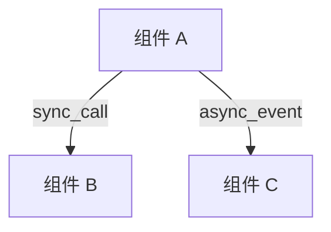
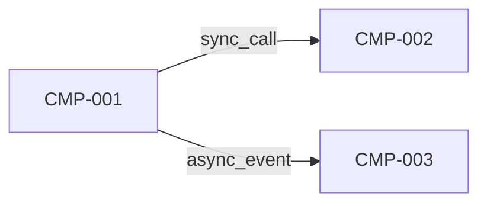
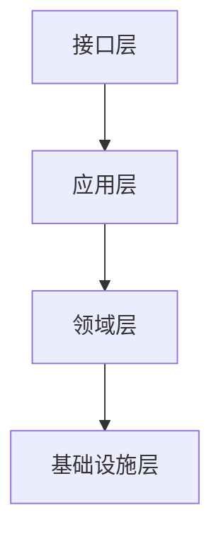
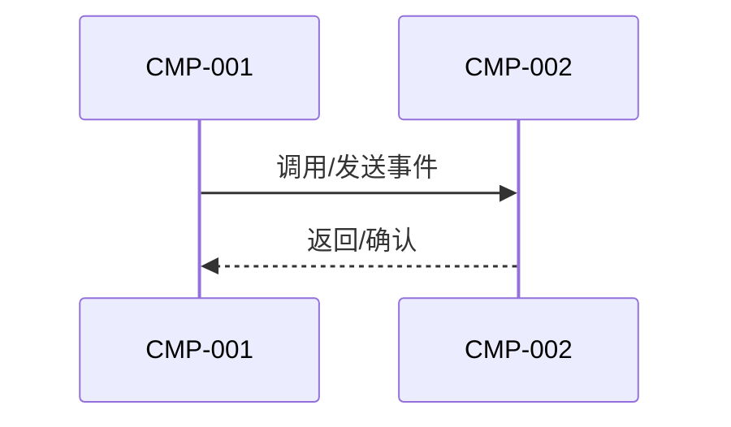
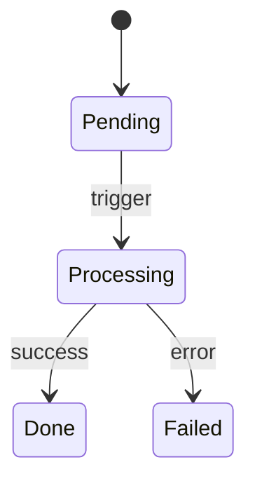
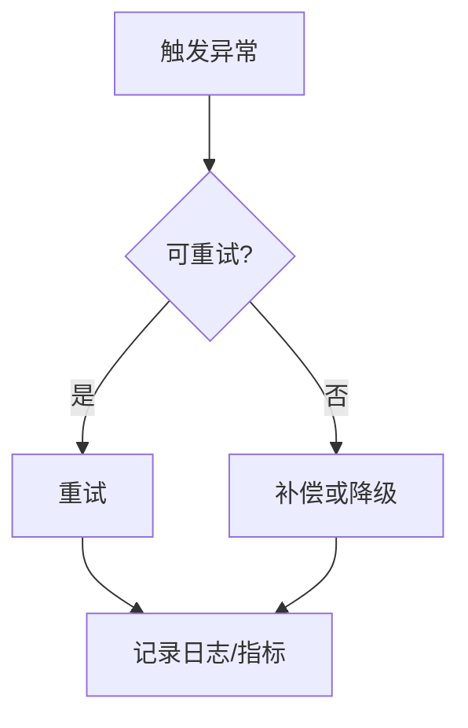
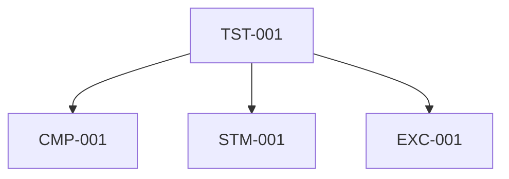
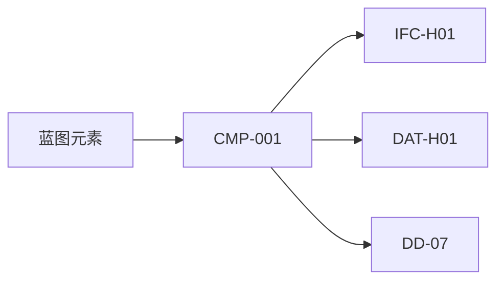

# G301 组件详细设计文档模板

## 1. 设计目标与范围

### 1.1 设计目标

- 设计目标摘要：
- 对齐的蓝图组件范围：
- 对齐的技术策略/约束：
- 成功标准：

### 1.2 范围边界

| scope_id | 范围项 | 类型 | 说明 | 来源约束 | 备注 |
|---|---|---|---|---|---|
| SCP-001 |  | in_scope / out_of_scope / deferred |  |  |  |

## 2. 组件职责与协作

### 2.1 组件清单

| component_id | 组件/模块 | 设计目标 | 核心职责 | 所属边界 | 优先级 |
|---|---|---|---|---|---|
| CMP-001 |  |  |  |  | high / medium / low |

### 2.2 职责分配矩阵

| responsibility_id | 能力/场景 | owner_component_id | collaborator_component_ids | 输入 | 输出 | 约束/规则 |
|---|---|---|---|---|---|---|
| RES-001 |  | CMP-001 | CMP-002 |  |  |  |

### 2.3 组件协作关系图（可选但推荐）

说明：

1. 当组件数量较多、协作路径复杂或跨边界责任较难从表格直接看清时，建议补充 Mermaid 图。
2. 图中的组件名、边界名、交互方向应与 `2.1`、`2.2` 及第 `7` 章结构化字段保持一致。

## 3. 内部结构与依赖

### 3.1 内部结构定义

| structure_id | component_id | 内部模块/层 | 职责说明 | 对外暴露点 | 关键扩展点 | 来源蓝图元素 |
|---|---|---|---|---|---|---|
| STR-001 | CMP-001 |  |  |  |  |  |

### 3.2 组件依赖与协作约束

| dependency_id | source_component_id | target_component_id | 依赖类型 | 调用方向 | 耦合约束 | 失效影响 |
|---|---|---|---|---|---|---|
| DEP-001 | CMP-001 | CMP-002 | sync_call / async_event / data_access / shared_lib | uni / bi |  |  |

### 3.2A 组件依赖关系图（复杂时推荐）

说明：

1. 当组件依赖多于 3 条、同时存在同步与异步混合依赖，或评审时难以只靠表格看清耦合方向时，建议补充 Mermaid 依赖图。
2. 图中的组件 ID、依赖方向、依赖类型应与 `3.2` 和 `7.5` 保持一致。

### 3.2B 内部结构分层图（复杂时推荐）

说明：

1. 当组件内部存在多层结构、多个模块或明显扩展点时，建议补充 Mermaid 分层图。
2. 图中的模块/层名称应能回链到 `3.1` 中的 `structure_id` 或对应描述。

### 3.3 关键交互流程图（可选）

说明：

1. 当需要说明跨组件调用顺序、事件触发链或协作编排时，可补充 Mermaid `sequenceDiagram`。
2. 图仅用于增强理解，不替代 `3.2`、`4.2` 和第 `7` 章中的正式结构化字段。

## 4. 状态转换与关键算法/规则

### 4.1 状态模型

| state_model_id | component_id | 状态对象 | 说明 | 持久化方式 | 回滚/恢复要求 |
|---|---|---|---|---|---|
| STM-001 | CMP-001 |  |  | memory / cache / db / event_log / none |  |

### 4.2 状态转换清单

| transition_id | state_model_id | from_state | to_state | trigger | guard_condition | failure_behavior |
|---|---|---|---|---|---|---|
| TRS-001 | STM-001 |  |  |  |  |  |

### 4.3 关键算法与规则

| algorithm_id | component_id | 算法/规则名称 | 输入 | 输出 | 关键步骤/决策点 | 复杂度/性能约束 | 失败语义 |
|---|---|---|---|---|---|---|---|
| ALG-001 | CMP-001 |  |  |  |  |  |  |

### 4.4 状态迁移或规则流程图（可选）

说明：

1. 状态复杂或规则链较长时，建议用 Mermaid `stateDiagram-v2` 或 `flowchart` 辅助表达。
2. 图中的状态名、触发条件和分支应能回链到 `4.1`、`4.2`、`4.3` 与第 `7` 章对应字段。

## 5. 异常处理与交接边界

### 5.1 异常处理设计

| exception_id | component_id | 异常场景 | 检测点 | 处理策略 | 重试/补偿/降级 | 日志/告警要求 |
|---|---|---|---|---|---|---|
| EXC-001 | CMP-001 |  |  |  |  |  |

### 5.1A 异常处理流程图（复杂时推荐）

说明：

1. 当异常需要区分检测、重试、补偿、降级、告警或人工介入路径时，建议补充 Mermaid 流程图。
2. 图中的异常节点和处理动作应能回链到 `5.1` 与 `7.8` 的结构化字段。

### 5.2 接口交接边界

| handoff_id | provider_component_id | consumer_component_id | 候选接口/消息 | boundary_responsibility | consumption_semantics | 调用语义 | 幂等/版本要求 | 错误语义边界 | 需 G302 细化内容 |
|---|---|---|---|---|---|---|---|---|---|
| IFC-H01 | CMP-001 |  |  |  | request_response / event_subscription / callback / batch_consume | sync_api / async_event / callback / batch |  |  |  |

### 5.2B 前端消费边界

**填写触发条件**：当 `2.1 组件清单` 中某组件的 `frontend_consumer=yes` 时，必须填写本表。

| handoff_id | provider_component_id | frontend_ui_ref | 前端调用能力 | 对应接口/消息 | 调用语义 | 前端特殊约束 | 需 G302 细化内容 |
|---|---|---|---|---|---|---|---|
| FCH-001 | CMP-001 | UI-001 |  |  | sync_api / async_event |  |  |

**字段说明**：
- `frontend_ui_ref`：指向 G102 `10.2` 前端界面清单中的界面 ID。
- `前端调用能力`：前端从该组件获取什么能力（数据查询/指令下发/事件订阅等）。
- `前端特殊约束`：大屏适配、实时推送、离线缓存、防重复提交等前端特有的交互或性能约束。
- `需 G302 细化内容`：G301 不做详细契约定义，只列出需要 G302 补充的项。

**与 5.2 的区别**：
- `5.2` 面向后端组件间调用，consumer 是后端组件。
- `5.2B` 面向前端-后端调用，consumer 是前端界面。

### 5.3 数据交接边界

| data_contract_id | owner_component_id | consumer_component_id | 数据对象 | boundary_responsibility | consumption_semantics | 读写边界 | 一致性要求 | 生命周期要求 | 需 G303 细化内容 |
|---|---|---|---|---|---|---|---|---|---|
| DAT-H01 | CMP-001 |  |  |  | read_model / write_model / sync_copy / event_projection |  |  |  |  |

### 5.4 设计风险与待确认项

| risk_id | target_type | target_id | related_transition_id | related_handoff_id | 风险/待确认项 | 影响范围 | 缓解/验证方式 | 评审关注点 |
|---|---|---|---|---|---|---|---|---|
| RSK-001 | component / structure / transition / algorithm / exception / interface_handoff / data_handoff | CMP-001 | TRS-001 | IFC-H01 |  |  |  |  |

## 6. 可测试性设计

| test_point_id | related_component_id | 测试对象 | 关键场景 | 观察点/断言 | 测试替身需求 | 验证方式 |
|---|---|---|---|---|---|---|
| TST-001 | CMP-001 | unit / module / state_machine / algorithm / exception_path |  |  |  | unit / integration / contract / simulation / review |

### 6.1 测试覆盖关系图（复杂时推荐）

说明：

1. 当测试点较多，且需说明测试点与组件、状态机、规则、异常路径的覆盖关系时，建议补充 Mermaid 图。
2. 图中的测试点、组件和对象应与 `6` 和 `7.11` 的稳定字段一致。

## 7. 方法检查清单

填写规则：

1. `已执行方法` 只能填写 [detailed-design-methods-catalog.md](../_shared/detailed-design-methods-catalog.md) 中定义的标准方法名：`设计范围冻结`、`约束回链`、`职责-协作映射`、`风险热点预判`、`内部结构分解`、`契约驱动设计`、`依赖反转校验`、`时序建模`、`状态机建模`、`规则决策表`、`前置/后置条件建模`、`并发与一致性分析`、`失败模式分析`、`可测试性分层设计`、`接口数据边界对齐`、`可观测性设计`。
2. 不得使用同义词、缩写、临时命名或自由改写名称。
3. 若某步骤启用了可选方法，也必须使用上述标准名称。

### 7.1 核心步骤方法对齐

| step_id | 必用方法 | 可选方法 | 已执行方法 | 备注 |
|---|---|---|---|---|
| step-1 | 设计范围冻结；约束回链；职责-协作映射 | 风险热点预判 |  |  |
| step-2 | 内部结构分解；契约驱动设计；依赖反转校验 | 时序建模 |  |  |
| step-3 | 状态机建模；规则决策表；前置/后置条件建模 | 并发与一致性分析 |  |  |
| step-4 | 失败模式分析；可测试性分层设计；接口数据边界对齐 | 可观测性设计 |  |  |

## 8. 质量检查预组装对齐信息

说明：

1. 本章由 `G301` 先预留文档级占位，供 `G300/DD-07` 汇总后补齐共享质量门上下文。
2. `overall_status`、问题计数和 `checked_at` 在 `G301` 起草完成时允许留空，不作为 `G301` 单独验收通过条件。
3. `GS-Quality-Check` 的正式结果不由 `G301` 维护。

| 项目 | 内容 |
|---|---|
| checker_tool | GS-Quality-Check |
| preflight_consumer | G300 / DD-07 |
| quality_report_path | artifacts/reviews/detailed-design-quality-check.md |
| quality_check_summary.overall_status | pass / pass_with_warning / fail |
| quality_check_summary.scores.completeness |  |
| quality_check_summary.scores.consistency |  |
| validation_summary.issue_count.critical |  |
| validation_summary.issue_count.major |  |
| validation_summary.issue_count.minor |  |
| validation_summary.issue_count.warning |  |
| checked_at | YYYY-MM-DD HH:mm |
| note | 正式质量门结果由 G300 汇总后触发 GS-Quality-Check 补齐 |

## 9. 追溯与证据

| conclusion_id | 结论 | 来源输入 | 证据说明 |
|---|---|---|---|
| TR-001 |  |  |  |

### 9.1 追溯关系图（复杂时推荐）

说明：

1. 当需要快速展示“蓝图元素 -> 组件设计 -> 下游交接 -> DD-07 汇总验证”的链路时，建议补充 Mermaid 追溯图。
2. 图中的对象名应优先使用稳定 ID，如 `CMP-*`、`IFC-H*`、`DAT-H*`、`TRS-*`。

