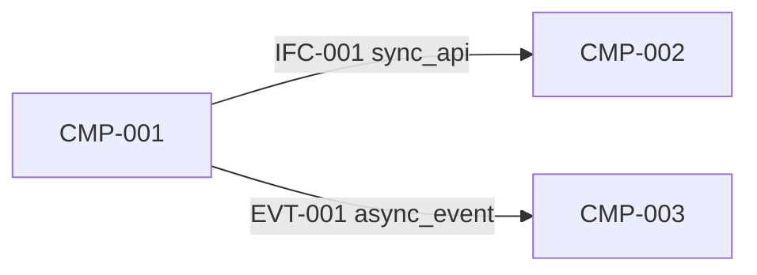
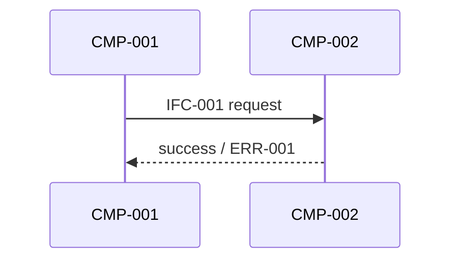
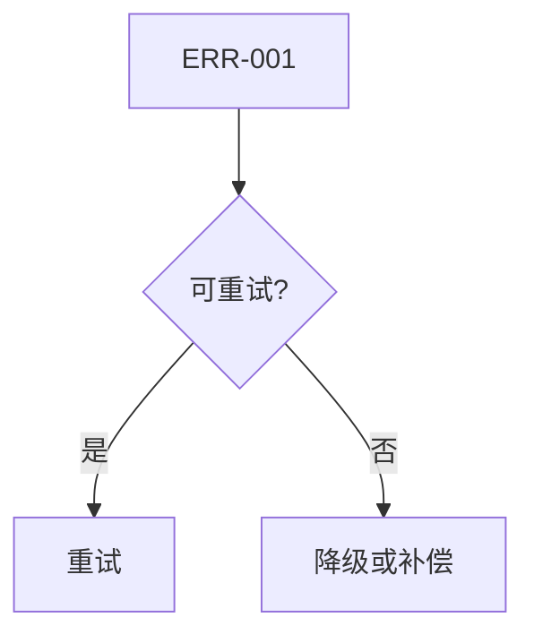
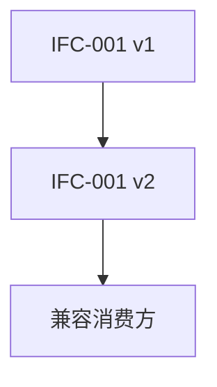
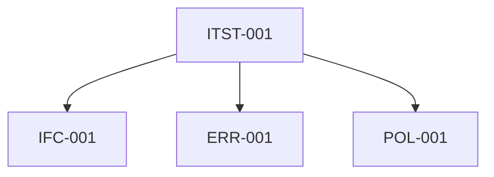
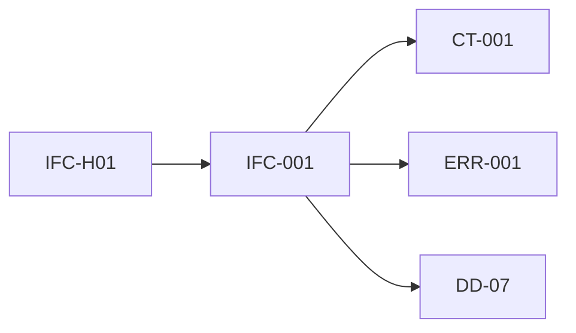

# G302 接口详细设计文档模板

## 1. 设计目标与范围

### 1.1 设计目标

- 设计目标摘要：
- 对齐的组件交接边界：
- 对齐的蓝图/技术策略约束：
- 成功标准：

### 1.2 范围边界

| scope_id | 范围项 | 类型 | 说明 | 来源约束 | 备注 |
|---|---|---|---|---|---|
| IFS-001 |  | in_scope / out_of_scope / deferred |  |  |  |

## 2. 接口目录与契约

### 2.1 接口清单

| interface_id | 接口/消息名称 | **interface_type** | provider_component_id | consumer_component_ids | 交互类型 | 所属边界 | 优先级 |
|---|---|---|---|---|---|---|---|
| IFC-001 |  | frontend-backend / backend-backend | CMP-001 | CMP-002 | sync_api / async_event / callback / batch |  | high / medium / low |

### 2.2 接口契约定义

| contract_id | interface_id | 请求/消息输入 | 响应/回执输出 | 字段约束 | 校验规则 | 来源 handoff_id |
|---|---|---|---|---|---|---|
| CT-001 | IFC-001 |  |  |  |  | IFC-H01 |

### 2.3 前端消费契约

**填写规则**：仅当 `interface_type=frontend-backend` 时填写本表。

**与 2.2 的关系**：`2.3` 是 `2.2` 接口契约的前端视角补充， frontend-specific 字段（TypeScript 类型、Mock 方案等）填在本表，backend-facing 字段（内部 DTO、数据库约束等）保留在 `2.2`。

| contract_id | interface_id | TypeScript类型定义 | 调用示例 | 鉴权/跨域策略 | Mock方案 | 前端错误处理建议 | 备注 |
|---|---|---|---|---|---|---|---|
| FCT-001 | IFC-001 |  |  |  |  |  |  |

**字段说明**：
- `TypeScript类型定义`：前端可直接使用的类型定义片段。
- `调用示例`：HTTP 方法 + 路径 + 关键参数示例。
- `鉴权/跨域策略`：JWT、Cookie、CORS、CSRF 等前端关心的安全策略。
- `Mock方案`：前端独立开发时的 Mock 数据方案（静态JSON / MockServer / Service Worker）。
- `前端错误处理建议`：不同错误码下前端应如何展示（弹窗/Toast/页面级/静默）。

### 2.4 接口边界关系图（复杂时推荐）

说明：

1. 当接口数量较多、存在跨边界交互或多个消费方时，建议补充 Mermaid 图。
2. 图中的接口名、组件名和交互方向应与 `2.1`、`2.2` 及第 `6` 章结构化字段保持一致。

## 3. 交互时序与错误语义

### 3.1 关键交互时序

| sequence_id | interface_id | 调用链/场景 | 同步或异步 | 超时/重试策略 | 补偿/回调策略 | 回指状态或异常 |
|---|---|---|---|---|---|---|
| SEQ-001 | IFC-001 |  | sync / async |  |  | TRS-001 / EXC-001 |

### 3.2 错误语义分层

| error_id | interface_id | 错误码/类别 | 失败语义 | 调用方责任 | 重试/降级建议 | 回指异常/风险 |
|---|---|---|---|---|---|---|
| ERR-001 | IFC-001 |  |  |  |  | EXC-001 / IRSK-001 |

### 3.3 时序交互图（复杂时推荐）

说明：

1. 当接口调用链存在多跳、异步确认、超时重试或补偿路径时，建议补充 Mermaid `sequenceDiagram`。
2. 图中的接口 ID、组件 ID、错误节点应能回链到 `3.1`、`3.2` 和第 `6` 章对应字段。

### 3.4 错误处理流程图（复杂时推荐）

说明：

1. 当错误需要区分调用方责任、可重试/不可重试、降级或补偿路径时，建议补充 Mermaid 流程图。
2. 图中的错误码、动作节点应能回链到 `3.2` 与 `6.5` 的结构化字段。

## 4. 版本、治理与测试约束

### 4.1 版本与幂等策略

| policy_id | interface_id | 版本策略 | 兼容范围 | 幂等键/去重规则 | 顺序性要求 | 备注 |
|---|---|---|---|---|---|---|
| POL-001 | IFC-001 |  |  |  |  |  |

### 4.2 可观测性与安全约束

| obs_sec_id | interface_id | 日志/指标/追踪要求 | 鉴权/脱敏要求 | 审计要求 | 告警阈值/触发条件 | 备注 |
|---|---|---|---|---|---|---|
| OBS-001 | IFC-001 |  |  |  |  |  |

### 4.3 版本兼容路径图（复杂时推荐）

说明：

1. 当同一接口存在多版本兼容、灰度切换或双写/双读策略时，建议补充 Mermaid 图。
2. 图中的版本名和切换路径应与 `4.1` 和第 `6.6` 章保持一致。

## 5. 可测试性设计

| test_point_id | related_interface_id | 测试对象 | 关键场景 | 观察点/断言 | 模拟依赖/替身需求 | 验证方式 |
|---|---|---|---|---|---|---|
| ITST-001 | IFC-001 | contract / integration / error_path / compatibility / **frontend_contract** |  |  |  | contract / integration / simulation / review |

**frontend_contract 测试说明**：`frontend_contract` 测试对象通常使用 `simulation`（验证 Mock 数据与契约一致性）或 `review`（人工审查 TypeScript 类型定义）。

### 5.1 测试覆盖关系图（复杂时推荐）

说明：

1. 当测试点较多，且需说明测试点与接口、错误语义、版本策略的覆盖关系时，建议补充 Mermaid 图。
2. 图中的测试点、接口和错误对象应与 `5` 和第 `6.8` 的稳定字段一致。

### 5.2 接口设计风险与待确认项

| risk_id | target_type | target_id | related_contract_id | related_error_id | 风险/待确认项 | 影响范围 | 缓解/验证方式 | 评审关注点 |
|---|---|---|---|---|---|---|---|---|
| IRSK-001 | interface / contract / sequence / error / policy | IFC-001 | CT-001 | ERR-001 |  |  |  |  |

## 6. 方法检查清单

填写规则：

1. `已执行方法` 只能填写 [detailed-design-methods-catalog.md](../_shared/detailed-design-methods-catalog.md) 中定义的标准方法名：`设计范围冻结`、`约束回链`、`契约驱动设计`、`契约一致性校验`、`接口数据边界对齐`、`兼容性策略设计`、`幂等与重试语义设计`、`时序交互建模`、`错误语义分层`、`失败模式分析`、`可测试性分层设计`、`可观测性设计`。
2. 不得使用同义词、缩写、临时命名或自由改写名称。
3. 若某步骤启用了可选图示，也必须保证图中对象名使用上述步骤输出中的标准稳定 ID。

### 6.1 核心步骤方法对齐

| step_id | 必用方法 | 已执行方法 | 备注 |
|---|---|---|---|
| step-1 | 设计范围冻结；约束回链；契约驱动设计 |  |  |
| step-2 | 契约驱动设计；契约一致性校验；接口数据边界对齐 |  |  |
| step-3 | 时序交互建模；错误语义分层；失败模式分析；幂等与重试语义设计 |  |  |
| step-4 | 兼容性策略设计；幂等与重试语义设计；可测试性分层设计；可观测性设计；契约一致性校验 |  |  |

## 7. 质量检查预组装对齐信息

说明：

1. 本章由 `G302` 先预留文档级占位，供 `G300/DD-07` 汇总后补齐共享质量门上下文。
2. `overall_status`、问题计数和 `checked_at` 在 `G302` 起草完成时允许留空，不作为 `G302` 单独验收通过条件。
3. `GS-Quality-Check` 的正式结果不由 `G302` 维护。

| 项目 | 内容 |
|---|---|
| checker_tool | GS-Quality-Check |
| preflight_consumer | G300 / DD-07 |
| quality_report_path | artifacts/reviews/detailed-design-quality-check.md |
| quality_check_summary.overall_status | pass / pass_with_warning / fail |
| quality_check_summary.scores.completeness |  |
| quality_check_summary.scores.consistency |  |
| validation_summary.issue_count.critical |  |
| validation_summary.issue_count.major |  |
| validation_summary.issue_count.minor |  |
| validation_summary.issue_count.warning |  |
| checked_at | YYYY-MM-DD HH:mm |
| note | 正式质量门结果由 G300 汇总后触发 GS-Quality-Check 补齐 |

## 8. 追溯与证据

| conclusion_id | 结论 | 来源输入 | 证据说明 |
|---|---|---|---|
| ITR-001 |  |  |  |

### 8.1 追溯关系图（复杂时推荐）

说明：

1. 当需要快速展示“G301 交接边界 -> G302 接口定稿 -> DD-07/GS-* 消费”的链路时，建议补充 Mermaid 追溯图。
2. 图中的对象名应优先使用稳定 ID，如 `IFC-H*`、`IFC-*`、`CT-*`、`ERR-*`。

