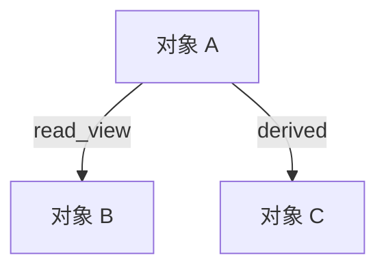
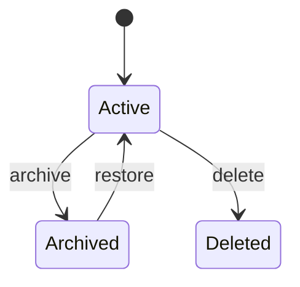
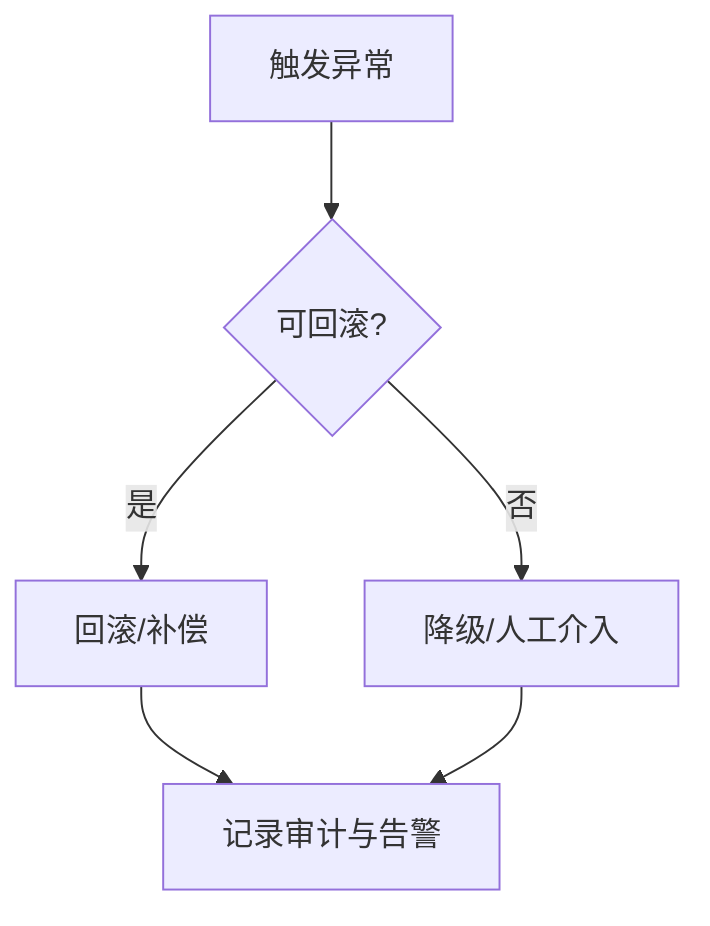
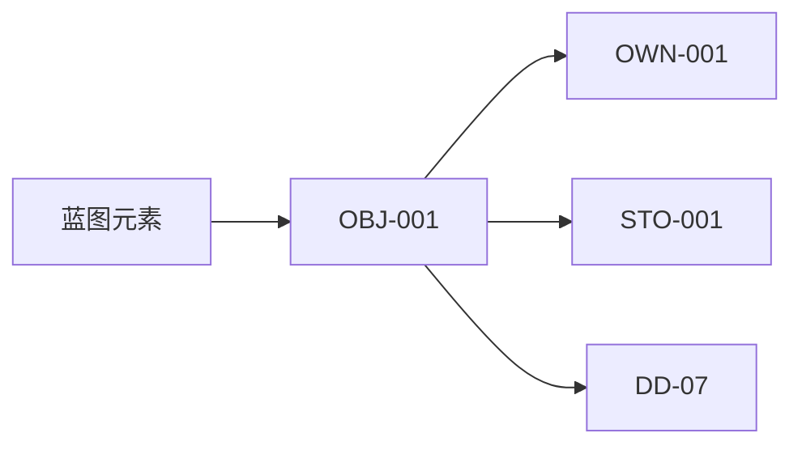

# G303 数据详细设计文档模板

## 1. 设计目标与范围

### 1.1 设计目标

- 设计目标摘要：
- 对齐的组件交接边界：
- 对齐的蓝图/技术策略约束：
- 成功标准：

### 1.2 范围边界

| scope_id | 范围项 | 类型 | 说明 | 来源约束 | 备注 |
|---|---|---|---|---|---|
| SCP-001 |  | in_scope / out_of_scope / deferred |  |  |  |

## 2. 数据对象、所有权与边界

### 2.1 数据对象清单

| data_object_id | 数据对象/实体/聚合 | 设计目标 | 核心职责 | 主属性族 | 所属边界 | source_data_contract_id | source_data_contract_table | source_data_contract_anchor | 优先级 |
|---|---|---|---|---|---|---|---|---|---|
| OBJ-001 |  |  |  |  |  | DAT-H01 | data_handoff_contracts | `5.3 数据交接边界` | high / medium / low |

### 2.1A 对象数量说明

| object_count_note_id | 对象数量 | 原因 | 边界收敛方式 |
|---|---|---|---|
| CNT-001 |  |  |  |

### 2.2 所有权与读写边界矩阵

| ownership_id | 数据对象/场景 | owner_component_id | consumer_component_ids | source_data_contract_id | source_data_contract_table | source_data_contract_anchor | 写入责任 | 读取视图 | 边界责任 | consumption_semantics |
|---|---|---|---|---|---|---|---|---|---|---|
| OWN-001 |  | CMP-001 | CMP-002 | DAT-H01 | data_handoff_contracts | `5.3 数据交接边界` |  |  |  | read_model / write_model / sync_copy / event_projection / derived_view |

### 2.3 数据关系或边界图（复杂时推荐）

说明：

1. 当数据对象较多、共享边界复杂或读写责任较难从表格直接看清时，建议补充 Mermaid 图。
2. 图中的数据对象名、边界名和流向应与 `2.1`、`2.2` 及第 `6` 章结构化字段保持一致。

## 3. 生命周期、状态与存储边界

### 3.1 存储边界定义

| storage_boundary_id | data_object_id | source_data_contract_id | 存储边界 | 落库/落存位置 | 访问层次 | 职责说明 | 对外暴露点 | 关键扩展点 | 来源蓝图元素 |
|---|---|---|---|---|---|---|---|---|---|
| STO-001 | OBJ-001 | DAT-H01 |  |  |  |  |  |  |  |

### 3.2 生命周期状态模型

| state_model_id | data_object_id | 状态对象 | 状态说明 | 持久化方式 | 保留策略 | 归档策略 | 删除策略 | 回滚/恢复要求 |
|---|---|---|---|---|---|---|---|---|
| STM-001 | OBJ-001 |  |  | db / event_log / cache / file / none |  |  |  |  |

### 3.3 生命周期状态迁移

| transition_id | state_model_id | from_state | to_state | trigger | guard_condition | failure_behavior | source_data_contract_id | source_data_contract_table | source_data_contract_anchor |
|---|---|---|---|---|---|---|---|---|---|
| TRS-001 | STM-001 |  |  |  |  |  | DAT-H01 | data_handoff_contracts | `5.3 数据交接边界` |

### 3.4 生命周期图（复杂时推荐）

说明：

1. 当数据状态、保留/归档/删除或恢复路径较复杂时，建议补充 Mermaid `stateDiagram-v2`。
2. 图中的状态名和迁移语义应与 `3.2`、`3.3` 和第 `6` 章对应字段保持一致。

## 4. 一致性、演化与迁移

### 4.1 一致性语义

| consistency_id | data_object_id | source_data_contract_id | source_data_contract_table | source_data_contract_anchor | 一致性级别 | 可见性 | 顺序性 | 冲突处理 | 并发约束 |
|---|---|---|---|---|---|---|---|---|---|
| CON-001 | OBJ-001 | DAT-H01 | data_handoff_contracts | `5.3 数据交接边界` | strong / bounded_staleness / eventual / session / causal |  |  |  |  |

### 4.2 演化与兼容策略

| evolution_id | data_object_id | source_data_contract_id | source_data_contract_table | source_data_contract_anchor | 版本策略 | 兼容窗口 | 字段变更规则 | 消费方影响 | 切换条件 |
|---|---|---|---|---|---|---|---|---|---|
| EVL-001 | OBJ-001 | DAT-H01 | data_handoff_contracts | `5.3 数据交接边界` |  |  |  |  |  |

### 4.3 迁移、回填与回滚策略

| migration_id | data_object_id | source_data_contract_id | source_data_contract_table | source_data_contract_anchor | 迁移/回填方案 | 双写/双读要求 | 校验点 | 回滚条件 | 风险热点 |
|---|---|---|---|---|---|---|---|---|---|
| MIG-001 | OBJ-001 | DAT-H01 | data_handoff_contracts | `5.3 数据交接边界` |  |  |  |  |  |

### 4.4 迁移路径图（复杂时推荐）

说明：

1. 当存在 schema 演化、双写双读、批量回填或回滚窗口时，建议补充 Mermaid 流程图或版本路径图。
2. 图中的版本名、迁移节点和回退条件应与 `4.2`、`4.3` 及第 `6` 章保持一致。

## 5. 异常处理、可测试性与风险

### 5.1 异常处理设计

| exception_id | data_object_id | source_data_contract_id | source_data_contract_table | source_data_contract_anchor | 异常场景 | 检测点 | 处理策略 | 重试/补偿/降级 | 日志/告警要求 |
|---|---|---|---|---|---|---|---|---|---|
| EXC-001 | OBJ-001 | DAT-H01 | data_handoff_contracts | `5.3 数据交接边界` |  |  |  |  |  |

### 5.2 可测试性设计

| test_point_id | related_data_object_id | related_handoff_contract_id | related_boundary_id | source_data_contract_id | source_data_contract_table | source_data_contract_anchor | 测试对象 | 关键场景 | 观察点/断言 | 测试替身需求 | 验证方式 |
|---|---|---|---|---|---|---|---|---|---|---|---|
| TST-001 | OBJ-001 | DAT-H01 | OWN-001 / STO-001 | DAT-H01 | data_handoff_contracts | `5.3 数据交接边界` | data_contract / handoff_contract / boundary / migration / backfill / recovery / consistency |  |  |  | unit / integration / contract / simulation / review |

### 5.3 数据设计风险与待确认项

| risk_id | target_type | target_id | related_state_transition_id | related_migration_id | source_data_contract_id | source_data_contract_table | source_data_contract_anchor | 风险/待确认项 | 影响范围 | 缓解/验证方式 | 评审关注点 |
|---|---|---|---|---|---|---|---|---|---|---|---|
| RSK-001 | data_object / ownership_boundary / storage_boundary / data_handoff / boundary / state_transition / consistency / evolution / migration / exception | OBJ-001 | TRS-001 | MIG-001 | DAT-H01 | data_handoff_contracts | `5.3 数据交接边界` |  |  |  |  |

### 5.4 异常或迁移流程图（复杂时推荐）

说明：

1. 当异常需要区分检测、重试、补偿、降级、回滚或人工介入路径时，建议补充 Mermaid 流程图。
2. 图中的异常节点和处理动作应能回链到 `5.1` 与 `6.9`、`6.11` 的结构化字段。

## 6. 供 G300、G301、DD-07、GS-Quality-Check 与 GS-Review 消费的最小字段

回链规则：

1. `source_table + 对应稳定 ID` 是正式主定位键。
2. `source_anchor` 与章节号只是人读辅助定位字符串，不作为唯一定位依据。
3. 若正文拆分或标题文案微调，必须优先保证 `source_table + 稳定 ID` 仍可回查。

### 6.1 data_scope

| scope_id | source_table | source_anchor | 设计目标 | 范围边界 | 延后项 | 来源约束 |
|---|---|---|---|---|---|---|
| SCP-001 | data_scope | `1.2 范围边界` |  |  |  |  |

### 6.2 data_object_catalog

| data_object_id | source_table | source_anchor | 数据对象/实体/聚合 | 设计目标 | 核心职责 | 主属性族 | 所属边界 | source_data_contract_id | source_data_contract_table | source_data_contract_anchor | 优先级 |
|---|---|---|---|---|---|---|---|---|---|---|---|
| OBJ-001 | data_object_catalog | `2.1 数据对象清单` |  |  |  |  |  | DAT-H01 | data_handoff_contracts | `5.3 数据交接边界` | high / medium / low |

### 6.3 ownership_and_boundary_matrix

| ownership_id | source_table | source_anchor | 数据对象/场景 | owner_component_id | consumer_component_ids | source_data_contract_id | source_data_contract_table | source_data_contract_anchor | 写入责任 | 读取视图 | 边界责任 | consumption_semantics |
|---|---|---|---|---|---|---|---|---|---|---|---|---|
| OWN-001 | ownership_and_boundary_matrix | `2.2 所有权与读写边界矩阵` |  | CMP-001 | CMP-002 | DAT-H01 | data_handoff_contracts | `5.3 数据交接边界` |  |  |  | read_model / write_model / sync_copy / event_projection / derived_view |

### 6.4 storage_boundary_specs

| storage_boundary_id | source_table | source_anchor | data_object_id | source_data_contract_id | source_data_contract_table | source_data_contract_anchor | 存储边界 | 落库/落存位置 | 访问层次 | 职责说明 | 对外暴露点 | 关键扩展点 |
|---|---|---|---|---|---|---|---|---|---|---|---|---|
| STO-001 | storage_boundary_specs | `3.1 存储边界定义` | OBJ-001 | DAT-H01 | data_handoff_contracts | `5.3 数据交接边界` |  |  |  |  |  |  |

### 6.5 data_lifecycle_specs

#### 6.5.1 state_models

| state_model_id | source_table | source_anchor | data_object_id | source_data_contract_id | source_data_contract_table | source_data_contract_anchor | 状态对象 | 状态说明 | 持久化方式 | 保留策略 | 归档策略 | 删除策略 | 回滚/恢复要求 |
|---|---|---|---|---|---|---|---|---|---|---|---|---|---|
| STM-001 | state_models | `3.2 生命周期状态模型` | OBJ-001 | DAT-H01 | data_handoff_contracts | `5.3 数据交接边界` |  |  | db / event_log / cache / file / none |  |  |  |  |

#### 6.5.2 state_transitions

| transition_id | source_table | source_anchor | state_model_id | data_object_id | source_data_contract_id | source_data_contract_table | source_data_contract_anchor | from_state | to_state | trigger | guard_condition | failure_behavior |
|---|---|---|---|---|---|---|---|---|---|---|---|---|
| TRS-001 | state_transitions | `3.3 生命周期状态迁移` | STM-001 | OBJ-001 | DAT-H01 | data_handoff_contracts | `5.3 数据交接边界` |  |  |  |  |  |

### 6.6 consistency_semantics_specs

| consistency_id | source_table | source_anchor | data_object_id | source_data_contract_id | source_data_contract_table | source_data_contract_anchor | 一致性级别 | 可见性 | 顺序性 | 冲突处理 | 并发约束 |
|---|---|---|---|---|---|---|---|---|---|---|---|
| CON-001 | consistency_semantics_specs | `4.1 一致性语义` | OBJ-001 | DAT-H01 | data_handoff_contracts | `5.3 数据交接边界` | strong / bounded_staleness / eventual / session / causal |  |  |  |  |

### 6.7 evolution_compatibility_specs

| evolution_id | source_table | source_anchor | data_object_id | source_data_contract_id | source_data_contract_table | source_data_contract_anchor | 版本策略 | 兼容窗口 | 字段变更规则 | 消费方影响 | 切换条件 |
|---|---|---|---|---|---|---|---|---|---|---|---|
| EVL-001 | evolution_compatibility_specs | `4.2 演化与兼容策略` | OBJ-001 | DAT-H01 | data_handoff_contracts | `5.3 数据交接边界` |  |  |  |  |  |

### 6.8 migration_risk_specs

| migration_id | source_table | source_anchor | data_object_id | source_data_contract_id | source_data_contract_table | source_data_contract_anchor | 迁移/回填方案 | 双写/双读要求 | 校验点 | 回滚条件 | 风险热点 |
|---|---|---|---|---|---|---|---|---|---|---|---|
| MIG-001 | migration_risk_specs | `4.3 迁移、回填与回滚策略` | OBJ-001 | DAT-H01 | data_handoff_contracts | `5.3 数据交接边界` |  |  |  |  |  |

### 6.9 data_exception_handling_specs

| exception_id | source_table | source_anchor | data_object_id | source_data_contract_id | source_data_contract_table | source_data_contract_anchor | 异常场景 | 检测点 | 处理策略 | 重试/补偿/降级 | 日志/告警要求 |
|---|---|---|---|---|---|---|---|---|---|---|---|
| EXC-001 | data_exception_handling_specs | `5.1 异常处理设计` | OBJ-001 | DAT-H01 | data_handoff_contracts | `5.3 数据交接边界` |  |  |  |  |  |

### 6.10 data_testability_design

| test_point_id | source_table | source_anchor | related_data_object_id | related_handoff_contract_id | related_boundary_id | source_data_contract_id | source_data_contract_table | source_data_contract_anchor | 测试对象 | 关键场景 | 观察点/断言 | 测试替身需求 | 验证方式 |
|---|---|---|---|---|---|---|---|---|---|---|---|---|---|
| TST-001 | data_testability_design | `5.2 可测试性设计` | OBJ-001 | DAT-H01 | OWN-001 / STO-001 | DAT-H01 | data_handoff_contracts | `5.3 数据交接边界` | data_contract / handoff_contract / boundary / migration / backfill / recovery / consistency |  |  |  | unit / integration / contract / simulation / review |

### 6.11 data_design_risks

| risk_id | source_table | source_anchor | target_type | target_id | related_state_transition_id | related_migration_id | source_data_contract_id | source_data_contract_table | source_data_contract_anchor | 风险/待确认项 | 影响范围 | 缓解/验证方式 | 评审关注点 |
|---|---|---|---|---|---|---|---|---|---|---|---|---|---|
| RSK-001 | data_design_risks | `5.3 数据设计风险与待确认项` | data_object / ownership_boundary / storage_boundary / data_handoff / boundary / state_transition / consistency / evolution / migration / exception | OBJ-001 | TRS-001 | MIG-001 | DAT-H01 | data_handoff_contracts | `5.3 数据交接边界` |  |  |  |  |

## 7. 方法检查清单

填写规则：

1. `已执行方法` 只能填写 [detailed-design-methods-catalog.md](../_shared/detailed-design-methods-catalog.md) 中定义的标准方法名：`设计范围冻结`、`约束回链`、`数据对象建模`、`读写边界分析`、`契约驱动设计`、`接口数据边界对齐`、`一致性与演化设计`、`数据保留与归档策略设计`、`并发与一致性分析`、`前置/后置条件建模`、`失败模式分析`、`迁移切换策略设计`、`可测试性分层设计`、`可观测性设计`、`风险热点预判`。
2. 不得使用同义词、缩写、临时命名或自由改写名称。
3. 若某步骤启用了可选图示，也必须保证图中对象名使用上述步骤输出中的标准稳定 ID。

### 7.1 核心步骤方法对齐

| step_id | 必用方法 | 可选方法 | 已执行方法 | 备注 |
|---|---|---|---|---|
| step-1 | 设计范围冻结；约束回链；数据对象建模 | 风险热点预判 |  |  |
| step-2 | 数据对象建模；读写边界分析；契约驱动设计；接口数据边界对齐 |  |  |  |
| step-3 | 一致性与演化设计；数据保留与归档策略设计；并发与一致性分析；前置/后置条件建模 | 失败模式分析；迁移切换策略设计 |  |  |
| step-4 | 失败模式分析；迁移切换策略设计；可测试性分层设计；可观测性设计 | 约束回链 |  |  |

## 8. 质量检查预组装对齐信息

说明：

1. 本章由 `G303` 先预留文档级占位，供 `G300/DD-07` 汇总后补齐共享质量门上下文。
2. `overall_status`、问题计数和 `checked_at` 在 `G303` 起草完成时允许留空，不作为 `G303` 单独验收通过条件。
3. `GS-Quality-Check` 的正式结果不由 `G303` 维护。
4. `quality_check_summary.scores` 口径与共享质量门保持一致，采用 `completeness`、`markdown_format`、`traceability`。

| 项目 | 内容 |
|---|---|
| checker_tool | GS-Quality-Check |
| preflight_consumer | G300 / DD-07 |
| quality_report_path | artifacts/reviews/detailed-design-quality-check.md |
| quality_check_summary.overall_status | pass / pass_with_warning / fail |
| quality_check_summary.scores.completeness |  |
| quality_check_summary.scores.markdown_format |  |
| quality_check_summary.scores.traceability |  |
| validation_summary.issue_count.critical |  |
| validation_summary.issue_count.major |  |
| validation_summary.issue_count.minor |  |
| validation_summary.issue_count.warning |  |
| checked_at | YYYY-MM-DD HH:mm |
| note | 正式质量门结果由 G300 汇总后触发 GS-Quality-Check 补齐 |

## 9. 追溯与证据

| conclusion_id | 结论 | 来源输入 | 证据说明 |
|---|---|---|---|
| DTR-001 |  |  |  |

### 9.1 追溯关系图（复杂时推荐）

说明：

1. 当需要快速展示“蓝图元素 -> 组件设计 -> 数据设计 -> 下游交接 -> DD-07 汇总验证”的链路时，建议补充 Mermaid 追溯图。
2. 图中的对象名应优先使用稳定 ID，如 `OBJ-*`、`OWN-*`、`STO-*`、`TRS-*`、`MIG-*`、`EXC-*`。

