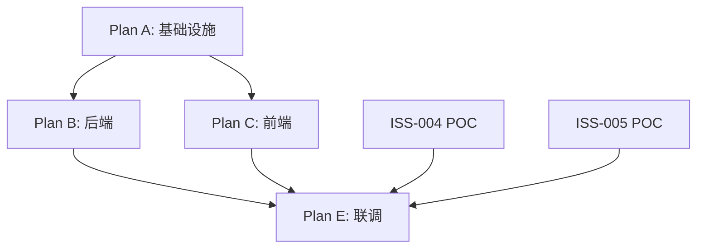

# 子计划模板参考

本文件是 `implementation-plan-generation` 的配套模板库。每种子计划类型对应一个标准模板，生成时按项目实际情况裁剪。

---

## 1. 基础设施类子计划模板

### 适用场景
仓库初始化、契约定义、CI/CD、数据库基线、开发环境搭建等。产出是**工程基座**，不以业务功能形式存在。

### 验收特征
每个任务的验收方式是"命令执行通过"（检查退出码），而非"测试用例通过"。

### 标准任务清单（按依赖排序，可按项目裁剪）

```
### Task 1: 仓库目录结构

> **追溯链** | 设计: <架构设计文档> §<仓库结构章节> | 需求: <基础设施需求ID>

- [ ] 创建目录结构
- [ ] 编写 .gitignore

验证: `ls <关键目录列表>` 确认全部存在

---

### Task 2-N: 契约定义

> **追溯链** | 设计: <接口设计文档> §<契约章节> | g402: artifacts/implementation/contracts/<contract>.md | 需求: <接口需求ID列表>

- [ ] 编写 proto 定义文件
- [ ] 编写 OpenAPI 规范文件

验证: `protoc --lint` 通过, `redocly lint` 零 error

---

### Task N+1: 代码生成脚本

> **追溯链** | 设计: <技术实现文档> §<代码生成章节> | 需求: <契约管理需求ID>

- [ ] 编写一键生成脚本（C++/Go/TS 等所有目标语言）
- [ ] 验证生成结果与源定义一致

验证: `bash <gen-script> && git diff --exit-code <gen-output-dir>`

---

### Task N+2: 数据库基线迁移

> **追溯链** | 设计: <数据设计文档> §<表结构章节> | g402: artifacts/implementation/data-defs/<model>.md | 需求: <数据存储需求ID>

- [ ] 编写基线迁移脚本（从设计文档的 DDL 提取）
- [ ] 编写 Go/Java/Python Model 结构体（与 DDL 一一对应）

验证: `<迁移工具> migrate` 通过, 目标数据库表可读写

---

### Task N+3: 多模块工作区

> **追溯链** | 设计: <技术策略文档> §<模块划分章节> | 需求: <工程结构需求ID>

- [ ] 配置多模块工作区（Go workspace / Gradle multi-project / npm workspace）
- [ ] 配置模块间依赖关系

验证: `<构建命令>` 全模块通过

---

### Task N+4: CMake/构建脚手架

> **追溯链** | 设计: <技术策略文档> §<编译构建章节> | 需求: <构建系统需求ID>

- [ ] 编写 CMakeLists.txt / BUILD 文件
- [ ] 配置编译选项（C++标准、warning as error）

验证: `cmake --build` 零 warning

---

### Task N+5: 前端工程初始化

> **追溯链** | 设计: <组件设计文档> §<前端框架章节> | 需求: <前端基础设施需求ID>

- [ ] 脚手架初始化（Vite/CRA/Next.js）
- [ ] 配置 TypeScript 严格模式
- [ ] 安装 UI 组件库

验证: `npm run build` 成功, `vue-tsc --noEmit` 零 error

---

### Task N+6: 本地开发环境

> **追溯链** | 设计: <部署设计文档> §<开发环境章节> | 需求: <开发环境需求ID>

- [ ] 编写 docker-compose.dev.yml（数据库 + 中间件）
- [ ] 编写构建镜像 Dockerfile

验证: `docker compose -f docker-compose.dev.yml up -d` 成功

---

### Task N+7: CI/CD Workflows

> **追溯链** | 设计: <技术策略文档> §<CI/CD章节> | 需求: <CI需求ID>

- [ ] 按目录变更分层编写 workflow 文件
- [ ] 契约校验 / 后端构建 / 前端构建 / 集成测试

验证: `actionlint` 零 error

---

### Task N+8: 端到端验证

> **追溯链** | 设计: <检查点定义> | 需求: <基础设施需求ID>

- [ ] 全链路验证：契约生成 → 数据库迁移 → 各模块构建 → CI 语法

验证: 全部通过
```

### 裁剪规则
- 技术栈为单语言时，Task N+3（多模块工作区）可跳过
- 无 C++ 组件时，Task N+4（CMake）可跳过
- 无前端时，Task N+5 可跳过
- 无 Docker 环境时，Task N+6 中的 Dockerfile 部分可跳过
- CI 平台非 GitHub Actions 时，Task N+7 的 actionlint 替换为对应平台的 lint 工具

---

## 2. 功能实现类子计划框架

### 适用场景
后端 API、前端页面、算法模块等有明确输入/输出行为的业务功能。

### 生成方式
**不直接展开**。将组件的设计文档片段 + 需求条目作为输入，调用 `superpowers:writing-plans` 生成 TDD 步骤序列。

### 传递给 writing-plans 的输入模板

```
## 组件: <组件名称>
## 设计依据: <设计文档路径> §<相关章节>
## g402 定义路径: <g402 细化定义文件路径列表>
## 需求映射: <需求ID列表>
## 接口契约: <接口定义文件路径> §<相关接口>
## 技术栈: <语言/框架/数据库>
## 文件位置: <代码目录路径>

## 功能描述
<从设计文档提取的该组件功能描述>

## 验收标准
<从设计文档提取的量化验收标准>
```

### 为什么委托给 writing-plans
`writing-plans` 的 TDD 模板（写失败测试 → 确认 RED → 最小实现 → 确认 GREEN → commit）已经成熟稳定。本技能的价值在于**传入正确的上下文**——设计依据、需求 ID、接口契约——确保 writing-plans 产出的每个 Step 都能通过追溯链验证。

---

## 3. 集成联调类子计划框架

### 适用场景
跨组件端到端联调、流媒体对接、外部系统集成、监控告警等。有明确的前置条件（POC 结论、上游子计划完成）。

### 生成模板

```
# <Plan 名称> 实施计划

> **状态: 条件待展开**
> **前置条件:**
> - <POC ID> 结论为通过
> - <上游子计划名称> 已完成且通过检查点验收
>
> **前置条件全部满足后，重新调用 implementation-plan-generation 展开本计划**

**Goal:** <一句话目标>

**Architecture:** <集成架构简述>

---

### Task 1~N: <待前置条件满足后展开>

每个 Task 预留：
- **组件**: <组件名称>
- **追溯链**: `> **追溯链** | 设计: <设计文档路径> §<章节> | 需求: <需求ID>`
- **验收标准**: <量化标准>
- **前置条件绑定**: <哪个 POC/上游 Plan 的哪个结论>
```

### 何时展开
前置条件全部满足后，由用户调用本技能，传入已满足的条件清单，本技能基于预留框架展开详细步骤。

---

## 4. 补齐修复类子计划模板

### 适用场景
设计漂移修复、技术债务清偿、版本对齐。有明确的"当前状态→目标状态"对照。

### 生成模板

```
### Task N: <修复项名称>

> **追溯链** | 设计: <目标设计文档> §<章节> | 需求: <关联需求ID>

**当前状态**: <代码/配置的现状描述>
**目标状态**: <设计文档定义的目标描述>

**变更文件**:
- 新增: <文件路径列表>
- 修改: <文件路径列表>
- 生成/衍生: <文件路径列表（由脚本产出）>

**验收**:
- <验收命令1> → 预期: <预期结果>
- <验收命令2> → 预期: <预期结果>
```

### 验收特征
- 前后对比：`diff` 结果、grep 字段命中数变化
- 编译零**新增** warning（已有 warning 不计入，但新增的必须为零）
- 契约一致性：生成代码零 diff
- 字段全链路对齐：跨技术栈 grep 验证

---

## 5. 主计划模板

### 用途
子计划的索引与编排中心，不包含具体任务。

### 模板

```
# <项目名称> 实施主计划

> **For agentic workers:** 本文件是实施计划的索引与路线图。实际执行请按顺序消费以下子计划。

**Goal:** <一句话目标>

**Architecture:** <2-3 句架构说明>

---

## 子计划清单

| 子计划 | 文件路径 | 类型 | 覆盖组件 | 验收标准 | 前置依赖 | 可并行 | 推荐引擎 |
|--------|----------|------|----------|----------|----------|--------|----------|
| Plan A | <path> | 基础设施 | <组件列表> | <验收标准> | 无 | 否 | executing-plans |
| Plan B | <path> | 功能实现 | <组件列表> | <验收标准> | Plan A | 与 C 并行 | subagent-driven |
| Plan C | <path> | 功能实现 | <组件列表> | <验收标准> | Plan A | 与 B 并行 | subagent-driven |
| Plan D | <path> | 集成联调 | <组件列表> | <验收标准> | Plan B+C+POC | 否 | 条件展开 |

---

## 依赖关系图



---

## 检查点配置

| 检查点 | 触发时机 | 验收维度 | 合格门槛 | 证据文件 |
|--------|----------|----------|----------|----------|
| CP-1 | Plan A 完成 | D4/D7/D8 | 编译零 warning, CI 全绿, 契约零 diff | `docs/exec-plans/checkpoints/cp-1-report.json` |
| CP-2 | Plan B/C 完成 | D1/D3/D4/D5/D7 | 覆盖率≥60%, 0 High/Critical 漏洞, 编译零 warning | `docs/exec-plans/checkpoints/cp-2-report.json` |
| CP-3 | Plan E 启动前 | 追溯链完整性 | 所有已完成 Task 含追溯链, 无孤儿需求 | `docs/exec-plans/checkpoints/cp-3-report.json` |
| CP-4 | 全部计划完成 | D1~D8 全维度 | 见 acceptance-criteria | `docs/exec-plans/checkpoints/cp-final-report.json` |

---

## 缺口汇总

| 指标 | 值 | 阈值 | 状态 |
|------|-----|------|------|
| 组件"待确认"占比 | <X>% | ≤30% | 通过 / 警告 / 阻断 |
| 依赖"已推导"占比 | <X>% | ≤50% | 通过 / 警告 |
| 验收标准"默认"占比 | <X>% | ≤30% | 通过 / 警告 |

> 组件"待确认"占比 > 50% 时为**阻断**，不可继续执行。

---

## 执行顺序建议

1. **先执行 Plan A**（基础设施）。阻塞所有后续编码。
2. **Plan A 通过 CP-1 后，Plan B 与 Plan C 可并行**。
3. **Plan D/E 待前置条件满足后启动**。

---

## 当前状态

| 子计划 | 状态 | 完成度 | 备注 |
|--------|------|--------|------|
| Plan A | 待执行 | 0/0 | |
| Plan B | 待执行 | 0/0 | |
| ... | | | |
```
