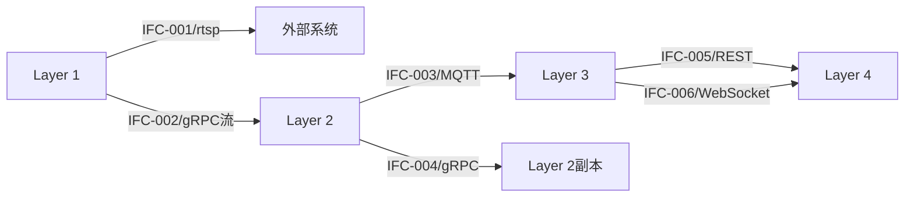
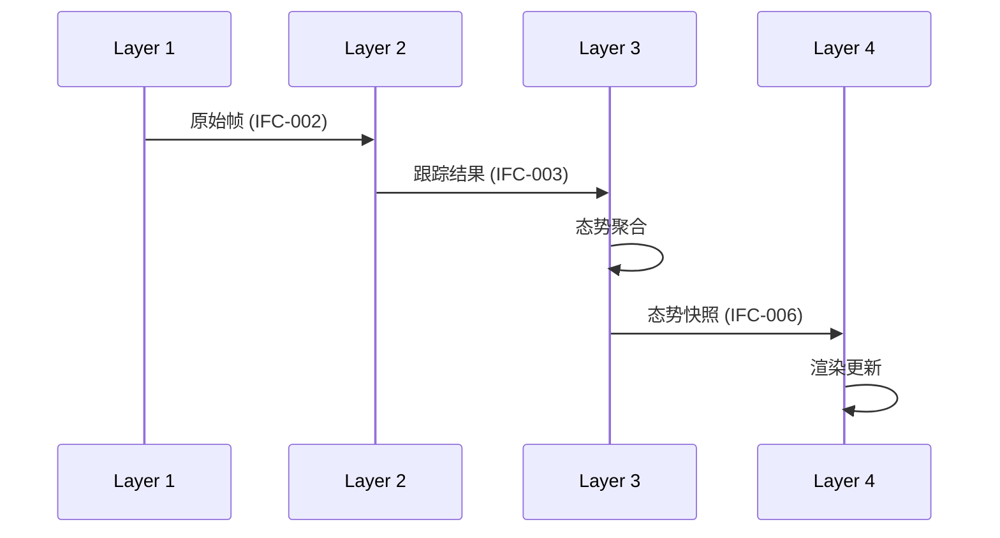

# 阶段三：分层设计（Layer Design）详细指南

## 目标

将实施策略转化为**可并行执行的技术层**，每层具备：
- 清晰的边界（做什么、不做什么）
- 明确的接口契约（输入/输出、协议、格式）
- 独立的交付时间表
- 指定的Owner

---

## 3.1 分层原则（Decomposition Rules）

### 规则1：按技术边界而非业务功能分层

**正确做法**：
```
Layer 1: 数据获取层（视频流、传感器）
Layer 2: 算法处理层（检测、跟踪、识别）
Layer 3: 业务逻辑层（聚合、计算、规则）
Layer 4: 表现层（API、WebSocket、UI）
```

**错误做法**：
```
模块A: 用户管理（含DB+API+UI）
模块B: 订单管理（含DB+API+UI）
```

**判定标准**：同一层内技术栈应一致，层间通过标准协议通信。

---

### 规则2：单层职责单一（Single Responsibility）

每层必须能用一句话描述，且包含以下要素：

```
[层名称] 负责 [核心职责]，通过 [输入接口] 接收 [输入数据]，
经过 [处理逻辑]，通过 [输出接口] 输出 [输出承诺]。
```

**示例**：
> **算法核心层**负责视频流的目标检测与跟踪，通过 RTSP/GStreamer 接收视频帧，
> 经过 AI 推理计算，通过 gRPC 流输出 TrackingResult。

**反模式检测**：
- 如果描述中出现"和/以及/同时" → 考虑拆分
- 如果涉及两种以上技术栈 → 考虑拆分
- 如果输出格式不一致 → 考虑拆分

---

### 规则3：层间依赖单向（Acyclic Dependencies）

```
允许：Layer 1 → Layer 2 → Layer 3 → Layer 4
禁止：Layer 1 ↔ Layer 2（双向依赖）
禁止：Layer 1 → Layer 2 → Layer 1（循环依赖）
```

**检测方法**：
绘制依赖图，如果出现箭头回指或双向箭头，重构。

---

## 3.2 层定义模板（Layer Definition Template）

每层必须填充以下结构化信息：

```markdown
### Layer N: [层名称]

**技术定位**：
- 所属边界：[边缘/中心/客户端]
- 技术栈：[语言/框架/运行时]
- 部署形态：[容器/进程/服务]

**核心职责**：
一句话描述（按规则2）

**输入契约**（向上游层/外部系统）：
| 接口ID | 来源 | 协议 | 数据格式 | 频率/量级 |
|--------|------|------|----------|-----------|
| IN-001 | 摄像头 | RTSP | H.264流 | 25fps/路 |
| IN-002 | 上游Layer | gRPC | XxxRequest | 事件触发 |

**输出契约**（向下游层）：
| 接口ID | 目标 | 协议 | 数据格式 | 保证级别 |
|--------|------|------|----------|----------|
| OUT-001 | Layer N+1 | gRPC流 | XxxResult | At-least-once |
| OUT-002 | 数据库 | SQL | INSERT/UPDATE | ACID |

**内部组件清单**：
| 组件ID | 组件名称 | 职责摘要 | 关键算法/模式 |
|--------|----------|----------|---------------|
| CMP-001 | Xxx | ... | ... |

**时间线承诺**：
- Week 1-2: [骨架里程碑]
- Week 3-4: [核心实现里程碑]
- Week 5-6: [集成优化里程碑]

**Owner**: [角色/人员]

**风险标记**：
| 风险ID | 描述 | 影响层 | 缓解方案 |
|--------|------|--------|----------|
| R-001 | ... | ... | ... |
```

---

## 3.3 层间接口契约定义（Interface Contract）

### 接口描述五要素

每个跨层接口必须明确定义：

```yaml
interface_contract:
  interface_id: "IFC-XXX"           # 唯一标识
  provider_layer: "Layer N"         # 提供方
  consumer_layer: "Layer N+1"       # 消费方
  
  protocol:                         # 通信协议
    type: [gRPC/MQTT/HTTP/WebSocket/共享内存]
    mode: [同步/异步/流式]
    
  data_contract:                    # 数据契约
    request_schema: "..."           # 请求格式（伪代码/JSON Schema）
    response_schema: "..."          # 响应格式
    error_schema: "..."             # 错误格式
    
  quality_attributes:               # 质量属性
    latency_ms: 100                 # 延迟要求
    throughput_rps: 1000            # 吞吐要求
    availability: "99.9%"           # 可用性要求
    
  lifecycle:                        # 生命周期管理
    version: "v1.0"                 # 当前版本
    freeze_date: "Week 2结束"       # 冻结日期
    deprecation_policy: "..."       # 弃用策略
```

### 契约变更控制

```
Week 1-2: 草案阶段（Draft）- 可自由修改
Week 2结束: 冻结点（Freeze Point）- 变更需审批
Week 3-6: 稳定阶段（Stable）- 变更需影响评估 + 下游层同意
```

**变更申请格式**：
```markdown
### 变更申请：IFC-XXX
- 申请层：[Layer N]
- 变更类型：[字段新增/类型修改/协议调整/删除]
- 影响范围：[Layer N+1, Layer N+2, ...]
- 回滚方案：[如果失败如何回滚]
- 审批状态：[待审批/已批准/已拒绝]
```

---

## 3.4 依赖关系图规范

### 必须绘制的视图

**视图1：分层架构图（Layer Stack）**
```
┌─────────────────────────────────┐
│  Layer 4: 表现层                 │
│  [技术栈Vue/React]               │
├─────────────────────────────────┤
│  Layer 3: 业务逻辑层             │
│  [技术栈Python/Go]               │
├─────────────────────────────────┤
│  Layer 2: 算法处理层             │
│  [技术栈C++/CUDA]                │
├─────────────────────────────────┤
│  Layer 1: 数据获取层             │
│  [技术栈GStreamer/驱动]          │
└─────────────────────────────────┘
```

**视图2：接口依赖图（Interface Map）**


**视图3：数据流图（Data Flow）**


---

## 3.5 验证检查点（Validation Checkpoints）

每层定义完成后，必须通过以下检查：

### 检查点1：边界清晰性

```
□ 层的输入是否全部来自明确的接口？
□ 层的输出是否全部通过明确的接口？
□ 层内部是否存在对外部系统的隐式依赖？
□ 层职责描述是否包含"和/或"等模糊词汇？
```

### 检查点2：接口完整性

```
□ 每个跨层接口是否有唯一的ID？
□ 每个接口是否定义了协议、格式、质量属性？
□ 每个接口是否指定了冻结日期？
□ 错误场景是否有处理方案？
```

### 检查点3：依赖无环性

```
□ 绘制依赖图，确认无循环依赖
□ 确认依赖方向与数据流方向一致
□ 确认无跨层跳跃依赖（Layer 1直接调Layer 3）
```

### 检查点4：可实现性

```
□ 单层时间线是否<=4周核心开发？
□ 每层是否有明确的Owner？
□ 技术栈是否与团队技能匹配？
□ 是否识别了至少1个风险点？
```

### 检查点5：可测试性

```
□ 每层是否有明确的输入模拟方案？
□ 每层是否有明确的输出生成物？
□ 层间接口是否有契约测试计划？
```

---

## 3.6 错误处理与边界情况

### 常见错误模式

**错误模式1：层职责过大**
- 症状：描述超过50字，包含多个动词
- 治疗：按"数据转换"vs"业务规则"vs"表现渲染"再拆分

**错误模式2：接口定义模糊**
- 症状："输出JSON"、"通过HTTP通信"
- 治疗：明确JSON Schema、明确HTTP方法/路径/状态码

**错误模式3：隐性依赖**
- 症状：Layer 2直接读取数据库，绕过Layer 1
- 治疗：所有数据流动必须通过定义的层间接口

**错误模式4：过早优化**
- 症状：Week 1就定义缓存策略、熔断机制
- 治疗：骨架阶段先跑通，优化放在Week 5-6

---

## 3.7 输出物标准

分层设计阶段必须产出：

```
docs/
└── implementation-phase-design.md
    ├── 3.1 分层架构图
    ├── 3.2 层定义模板（按Layer N逐一填充）
    ├── 3.3 接口契约清单（所有IFC-XXX）
    ├── 3.4 依赖关系图（Mermaid）
    ├── 3.5 时间线对齐（甘特式）
    ├── 3.6 风险与缓解
    └── 3.7 验证检查点通过记录
```

---

## 附录：快速决策树

```
开始分层设计
    │
    ├─ 是否有明确的技术边界？
    │   ├─ 否 → 按技术栈先分类
    │   └─ 是 → 继续
    │
    ├─ 每层能否用一句话描述？
    │   ├─ 否 → 拆分直到能
    │   └─ 是 → 继续
    │
    ├─ 层间依赖是否单向？
    │   ├─ 否 → 重构消除循环
    │   └─ 是 → 继续
    │
    ├─ 接口契约是否完整？
    │   ├─ 否 → 补充五要素
    │   └─ 是 → 继续
    │
    └─ 通过所有验证检查点？
        ├─ 否 → 修复问题
        └─ 是 → 冻结，生成设计文档
```

---

**本指南用于**：指导LLM独立执行分层设计任务  
**不包含**：特定技术栈细节、项目业务逻辑  
**可复用**：任何需要分层并行实施的项目